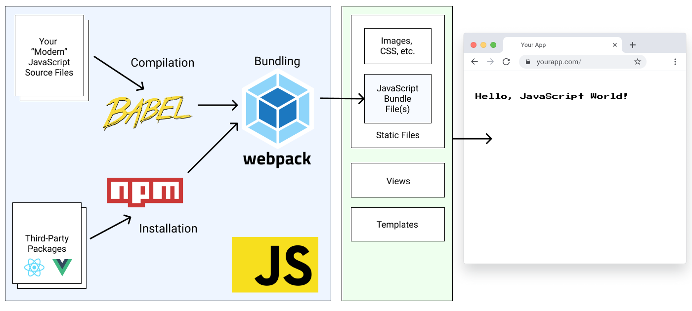

# Intro

In der Webentwicklung führt natürlich kein Weg an JavaScript vorbei. Die Programmiersprache selbst
ist - im Vergleich zu C# oder Java - leichter erlernbar. Wichtig ist zu Beginn, verschiedene Dinge
zu entflechten und getrennt zu betrachten:
- JavaScript kann im Browser oder mit Node.js als Laufzeitumgebung ausgeführt werden.
- Es gibt Objekte und Funktionen, die im Sprachkern durch ECMAScript zur Verfügung gestellt werden
  (Date, Stringfunktionen, ...). Sie stehen überall zur Verfügung.
- Einige Objekte stehen nur im Browser zur Verfügung (window, document, ...).
- Node.js bietet mit npm (oder yarn) einen Packetmanager, mit dessen Hilfe externe Bibliotheken
  verwendet werden können.

Wir müssen daher einmal den Kern von JavaScript (Syntax und die vordefinierten Objekte im ECMAScript
Standard) von anderen Erweiterungen trennen. Im ersten Kapitel geht es um genau diese Grundlagen.

## Was ist Node.js

> Node.js is an open-source, cross-platform, back-end JavaScript runtime environment that runs on 
> the V8 engine and executes JavaScript code outside a web browser. Node.js lets developers use
> JavaScript to write command line tools and for server-side scripting—running scripts server-side 
> to produce dynamic web page content before the page is sent to the user's web browser.
> <sup>https://en.wikipedia.org/wiki/Node.js</sup>

Node.js ist also eine Laufzeitumgebung für JavaScript Code. Dies hat noch nichts mit einem
Webserver zu tun. Dass Node.js sowohl für die Generierung von Clientcode (js Dateien, die im
Browser ausgeführt werden) als auch als Webserver (Express Paket) dienen kann, verwirrt oft.

### Node.js als Server

Dass Node.js auch als Webserver dienen kann, sprich einen Port öffnet und HTTP Anfragen beantwortet, verdankt es einem Fremdpaket (Express). Mit folgenden Anweisungen kann ein
Webserver, der *Hello World!* ausgibt, gestartet werden:

```javascript
const express = require('express')
const app = express()
const port = 3000

app.get('/', (req, res) => {
  res.send('Hello World!')
})

app.listen(port, () => {
  console.log(`Example app listening at http://localhost:${port}`)
})
```

Wir werden in diesem Kurs ASP.NET Core als Webserver verwenden. Daher betrachten wir das Thema
Express nicht weiter. Auf https://expressjs.com/de/ ist für Interessierte eine ausführliche
Beschreibung vorhanden.

### Node.js für die Cliententwicklung

Der zweite Anwendungsfall ist für uns schon interessanter. Wir können mit der Node.js Umgebung
JavaScript Code schreiben, der dann für den Browser entsprechend aufbereitet wird. Damit dies
möglich ist, gibt es ein zentrales Paket: *Webpack*. Es erzeugt aus dem JavaScript Code ein
sogenanntes *bundle*. Dieses Bundle wird mit einer *index.html* Datei erzeugt.


<sup>https://docs.saaspegasus.com/front-end.html</sup>

Jetzt kommen auch die in der Grafik abgebildeten *Third Party Packages* ins Spiel. Dies sind die
sehr bekannten Pakete Angular, React oder Vue.js. Sie sind nichts anderes als speziell für die
Cliententwicklung angepasste Pakete. Sie stellen folgende Möglichkeiten bereit:
- Kombination von HTML und JavaScript mit sogenannten *Komponenten*.
- Clientseitiges Routing
- State Management und Bindings.

Auch hier ist der Prozess der selbe: Die React, Vue, ... Applikation wird über Webpack zu einer
HTML und JS Datei. Diese Applikation kann jeder Webserver hosten. In unserem Fall wird ASP.NET Core
die Applikation als statische Dateien ausliefern. Natürlich kann auch Apache (XAMPP) diesen
Job erledigen.

## ECMAScript und JavaScript

Sucht man nach Informationen zu JavaScript entsteht oft Verwirrung, da die Begriffe JavaScript
und ECMAScript austauschbar verwendet werden.

*ECMAScript* definiert einen Sprachstandard. Es ist keine Programmiersprache, sondern lediglich
ein Dokument welches Operatoren, Statements, ... und deren Verhalten beschreibt. JavaScript
ist die *Implementierung* dieses Standards in Form einer konkreten Programmiersprache.

In den frühen Zeiten des Web war JavaScript stark browserabhängig. Einige Browser implementierten
Methoden, die andere Browser nicht kannten. Für uns ist der Standard *ECMAScript 6 (2015)* von
besonderem Interesse. Hier wurden erstmals Konzepte zur Entwicklung größerer Applikationen wie
Klassen und Module vorgestellt. Es ist der Standard, den wir für die heutige Webentwicklung
verwenden.

Natürlich gab es in der Zwischenzeit weitere Fortschritte, wie die folgende Aufstellung zeigt:

| Version       | Jahr | Dokumentation                                                                      | Neuerungen                                                 |
| ------------- | ---- | ---------------------------------------------------------------------------------- | ---------------------------------------------------------- |
| ECMAScript 6  | 2015 | https://262.ecma-international.org/6.0 [[als PDF](ECMA-262_6th_edition_june_2015.pdf)]   |                                                            |
| ECMAScript 7  | 2016 | https://262.ecma-international.org/7.0                                             |                                                            |
| ECMAScript 8  | 2017 | https://262.ecma-international.org/8.0                                             | await/async                                                |
| ECMAScript 9  | 2018 | https://262.ecma-international.org/9.0                                             | spread operator ...                                        |
| ECMAScript 10 | 2019 | https://262.ecma-international.org/10.0                                            |                                                            |
| ECMAScript 11 | 2020 | https://262.ecma-international.org/11.0                                            | nullish coalescing operator (`??`), optional chains (`?.`) |
| ECMAScript 12 | 2021 | https://262.ecma-international.org/12.0 [[als PDF](ECMA-262_12th_edition_june_2021.pdf)] | logical assignment operators (`??=`, `&&=`, `\|\|=`)       |

Zudem definiert ECMAScript noch ein *Global Object*. Es beinhaltet Funktionen und Objekte, die immer
zur Verfügung stehen (ECMAScript 6):

- **Funktionen:** eval, isFinite, isNaN, parseFloat, parseInt
- **Konstruktoren:** Array, ArrayBuffer, Boolean, DataView, Date, Error, EvalError, Float32Array,
Float64Array, Function, Int8Array, Int16Array, Int32Array, Map, Number, Object, Proxy, Promise,
RangeError, ReferenceError, RegExp, Set, String, Symbol, SyntaxError, TypeError, Uint8Array,
Uint8ClampedArray, Uint16Array, Uint32Array, URIError, WeakMap, WeakSet, 
- **Statische Objekte:** JSON, Math, Reflect

## Die MDN Dokumentation

Auf https://developer.mozilla.org/en-US/docs/Web/JavaScript/Reference gibt es Anwendungsbeispiele
und Beschreibungen. Sie ist die erste Anlaufstelle bei JavaScript Fragen. Wenn es um die
Verwendung von JavaScript im Browser geht, kann auf https://developer.mozilla.org/en-US/docs/Web/API
nachgesehen werden.

## Polyfill

Wenn wir eine neue Applikation entwickeln, wollen wir natürlich auch neue Features verwenden.
So können wir z. B. folgenden Code schreiben, um val den Wert 0 zuzuordnen, wenn val *undefined*
oder *null* ist:
```javascript
let val;
val ??= 0;
console.log(val);
```

Der Operator `??=` wurde jedoch erst mit ECMAScript 12 (2021) eingeführt. Um eine Kompatibilität
zu älteren Browsern herzustellen gibt es Bibliotheken, die den Code automatisch umschreiben. Auf
https://babeljs.io/repl kann dieser Code eingefügt werden. Die Ausgabe liefert:

```javascript
"use strict";

var _val;

let val;
(_val = val) !== null && _val !== void 0 ? _val : val = 0;
console.log(val);
```

Der `??=` Operator wurde also durch Code, den ältere Browser verstehen, ergänzt. Diesen Vorgang
bezeichnen wir als *polyfill* ("Spachtelmasse"). In der Buildchain von Node.js Applikationen kann
dieser Schritt automatisch durchgeführt werden.

## JSON als Austauschformat

Das Dokument [The JSON Data Interchange Syntax](ECMA-404_2nd_edition_december_2017.pdf)
beschreibt den Aufbau von JSON Dokumenten zum Datenaustausch z. B. zwischen einer API und dem
Client.

## Ausführen der ersten Applikation

Prüfe, ob Node.js korrekt installiert ist (siehe [Installation](../Software_Installation.md)).
Öffne dafür die Konsole und führe das Kommando *node --version* aus. Es wird die Version von Node.js
ausgegeben.

Starte danach Visual Studio Code. Erstelle eine neue Datei *first_app.js*. Füge danach den
folgenden Code ein:

```javascript
function greet(name) {
    return `Hello ${name}!`;
};

console.log(greet("Michael"));
```

Nun starte das Terminal mit CTRL + Ö (deutsches Layout) oder  CTRL + Backtick (US Layout). Gib
*node first_app.js* ein. Die Datei wird ausgeführt und *Hallo Michael!* erscheint auf der Konsole.

Setze danach einen Breakpoint in Zeile 2 (klicke links von der Zeilennummer). Drücke danach
*F5* in VS Code. Beim ersten Start des Debuggers wirst du nach der Debugumgebung gefragt. Wähle
dafür *node* aus. Das Programm bleibt dann in Zeile 2 stehen und kann mit folgenden Shortcuts
geprüft werden:

- **F10:** Step over (setzt in der nächsten Zeile fort und geht nicht in eine Funktion hinein).
- **F11:** Step into (geht in die Funktion hinein).
- **F5:** Führt das Programm bis zum nächsten Breakpoint aus.
