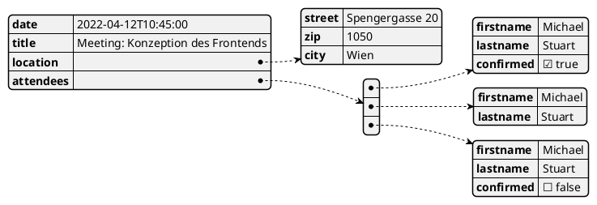

# Variablen und JSON

## Deklaration

In Sprachen wie Java oder C#, die static Typing umsetzen, erfolgt die Deklaration einer Variable
stets mit dem Datentyp. Auch das Schlüsselwort *var*, welches in Java oder C# existiert, legt
den Typ fest. Nur wird dieser Typ vom Compiler bestimmt.

JavaScript ist "weakly typed" oder "untyped". JavaScript legt den internen Typ anhand der Werte
fest, die sich in der Variable befinden. Diese können jederzeit verändert werden.

Früher wurde mit dem Schlüsselwort *var* eine Variable deklariert:

```javascript
var i = 0;
i = false;   // not possible in Java or C#
```

**Diese Art der Deklaration wird heute nicht mehr verwendet!** Betrachten wir folgenden Code:

```javascript
console.log(j);                // undefined, but no runtime exception
for(var i = 0; i < 10; i++) {
    var j = i;
}
console.log(j);                // 9
```

Die Ausgabe von 9 verwundert, denn die Variable wurde innerhalb der Schleife deklariert. Also müsste
sie nur dort gültig sein. Bei *var* führt JavaScript sogenanntes *hoisting*, die Deklaration wird
quasi an die Spitze des Codes gestellt. Dadurch können wir j auch vor der Schleife ausgeben.

Gerade letzteres - nämlich das Zurückgeben von *undefined* ohne Laufzeitfehler - ist kritisch. Deswegen
wurde im ECMAScript 6 Standard nachgeschärft und 2 Schlüsselworte wurden eingeführt: *let* und *const*.

*let* definiert veränderbare Variablen, die allerdings nur - wie erwartet - im Block, wo sie
deklariert wurden, zugreifbar sind.

```javascript
console.log(j);                // ReferenceError: j is not defined
for(let i = 0; i < 10; i++) {
    let j = i;
}
console.log(j);                // ReferenceError: j is not defined
```

Wenn Variablen nicht verändert werden sollen, dann können wir *const* verwenden. Eine neue Zuweisung
zu *step* würde einen Laufzeitfehler verursachen. *const* braucht einen Initialwert.
```javascript
const step = 10;
for(let i = 0; i < 100; i += step) {
    console.log(i);           // 0, 10, 20, ..., 90
}
step++;                       // TypeError: Assignment to constant variable.
```

## Interne Datentypen

ECMAScript definiert folgende Datentypen, die in Variablen und Literalen (fixe Werte im Code)
auftreten können:<sup>vgl. https://262.ecma-international.org/6.0/#sec-ecmascript-language-types</sup>
- Undefined
- Null
- Boolean
- String
- Number
- Object

Der Typ *Undefined* ist für Variablen, die keinen zugewiesenen Wert haben.

### Typeof

Oft wollen wir bestimmen, welcher Typ konkret als Wert der Variable vorliegt. Der *typeof*
Operator liefert den Typ als String zurück. Beachte, dass der Typ von *null* als *object*
geliefert wird.

| Type of val                                       | Result      |
| ------------------------------------------------- | ----------- |
| Undefined                                         | "undefined" |
| Null                                              | "object"    |
| Boolean                                           | "boolean"   |
| Number                                            | "number"    |
| String                                            | "string"    |
| Symbol                                            | "symbol"    |
| Object (ordinary and does not implement [[Call]]) | "object"    |
| Object (implements [[Call]])                      | "function"  |

<sup>Vgl. https://262.ecma-international.org/6.0/#sec-typeof-operator</sup>

```javascript
let step;
console.log(step);         // "undefined"
step = 1;
console.log(typeof step);  // "number"
step = true;
console.log(typeof step);  // "boolean"
step = "1";
console.log(typeof step);  // "string"
step = null;
console.log(typeof step);  // "object"
```

### Implizite Typkonversionen

#### Vergleiche mit ==

Auch in Sprachen wie C# können Werte mit unterschiedlichen Datentypen verglichen werden. So
liefert `if (1.0 == 1)` true, obwohl es ein Vergleich zwischen einem *double* und einem *int*
Wert ist. C# ist jedoch sehr streng, was Vergleiche betrifft. So kann *false* nicht mit *0*
verglichen werden. Dies wird mit einem Compilerfehler enden.

In JavaScript treten (fast) nie Laufzeitfehler bei Vergleichen auf. Bei einem Vergleich wird
eine sehr großzügige Typumwandlung erlaubt. Numerisch interpretierbare Strings können mit
Zahlen verglichen werden (1 und 2). Treffen Strings und Zahlen aufeinander, die nicht umwandelbar
sind, wird einfach false geliefert (3). Bei boolean Werten wird 0 als false und 1 als true
angenommen (4 - 7). Der Vergleich mit null liefert false, außer zwei null Werte werden
verglichen (8 - 9).

```javascript
console.log(1 == "1");            // (1) true
console.log(1 == "   1 ");        // (2) true
console.log("ABCD" == 3.14159);   // (3) false
console.log(0 == false);          // (4) true
console.log(1 == true);           // (5) true
console.log("false" == false);    // (6) false
console.log("0" == false);        // (7) true
console.log(0 == null);           // (8) false
console.log(null == null);        // (9) true
```

#### Vergleiche mit ===

Dieses Vergleichsverhalten hat natürlich seine Geschichte. Über HTTP werden Formulardaten als
String übertragen. Somit ist das Verhalten, Strings mit Zahlen als Zahl zu behandeln, oft von
Vorteil. Manchmal möchte man aber strenger sein. Der *===* Operator liefert nur true, wenn auch
die Typen gleich sind. Daher liefern die folgenden Beispiele alle false (keine Gleichheit):

```javascript
console.log(1 === "1");            // false
console.log(1 === "   1 ");        // false
console.log(0 === false);          // false
console.log(1 === true);           // false
console.log("0" === false);        // false
```

!== verhält sich invers, liefert also bei den Beispielen immer true.

#### Mathematische Operationen

Auch bei mathematischen Operationen wie +, -, * und / wird die Stringumwandlung durchgeführt.
Da + aber auch die Stringverknüpfung ist, liefert das Beispiel (1) einen verknüpften String.
Die anderen Operationen (-, * und /) sind nur für Zahlen definiert. Daher werden Strings - wenn
möglich - als Zahl interpretiert (Beispiele 2 bis 4).

Die schnellste Umwandlung von Strings in Zahlen ist also die Multiplikation mit 1. Die Division
von 2 ganzen Zahlen liefert eine Dezimalzahl und nicht wie in C# eine Ganzzahl.  

```javascript
console.log(1 + "1");       // (1) 11
console.log(1 + 1 * "1");   // (2) 2
console.log(1 - "1");       // (3) 0
console.log("1"/"2");       // (4) 0.5
```

#### if mit Ausdrücken, die nicht boolean sind

In C# oder Java muss ein Ausdruck, der in einem *if* Statement verwendet wird, einen *boolean*
Wert (true oder false) zurückliefern. In JavaScript muss dies nicht so sein. So können z. B.
auch Variablen, die keinen Wert vom Typ *boolean* enthalten, mit *if* abgefragt werden.

```javascript
let count;
if (!count) /* returns true */ {
    console.log("!count is true because it is undefined.")
}
count = 0;
if (!count) /* returns true */ {
    console.log("!count is true because it is 0 (number).")
}
count = "0";
if (!count) /* returns FALSE! */ {
    console.log("!count is true because it is \"0\" (string).");
}
```

Die Ausgabe liefert beim ersten und zweiten Statement den erwarteten Wert, das 3. Statement liefert
jedoch nicht true:
```text
!count is true because it is undefined.
!count is true because it is 0 (number).
```

Die Erklärung liegt im ECMAScript Sprachstandard. Strings sind nur *false*, wenn sie leer sind.

| Argument Type | Result                                                                                    |
| ------------- | ----------------------------------------------------------------------------------------- |
| Undefined     | Return false.                                                                             |
| Null          | Return false.                                                                             |
| Boolean       | Return argument.                                                                          |
| Number        | Return false if argument is +0, −0, or NaN; otherwise return true.                        |
| String        | Return false if argument is the empty String (its length is zero); otherwise return true. |
| Symbol        | Return true.                                                                              |
| Object        | Return true.                                                                              |

<sup>vgl. https://262.ecma-international.org/6.0/#sec-toboolean</sup>

Gerade die fehlende Unterscheidung zwischen 0 und *undefined* macht es oft nötig, den === Operator
zu nutzen. So liefert `if (count === undefined)` auch nur true, wenn *count* nicht zugewiesen wurde.

## Die JavaScript Object Notation (JSON)

### Datum und Zeit

### Hinzufügen und Löschen

### Vergleiche von JSON Objekten

## Arrays

## Übung

Das folgende Diagramm zeigt ein JSON Object. Definiere dieses Objekt in JavaScript
und speichere es in der Variable Student.



