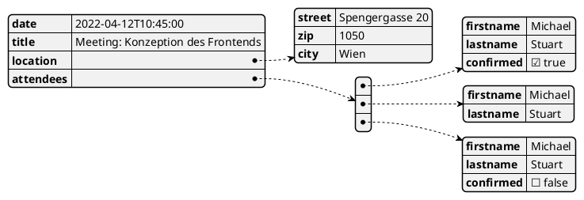

# JSON und Arrays

### Datum und Zeit

### Hinzufügen und Löschen

### Vergleiche von JSON Objekten

## Arrays

## Übung

Das folgende Diagramm zeigt ein JSON Object. Definiere dieses Objekt in JavaScript
und speichere es in der Variable Student.

