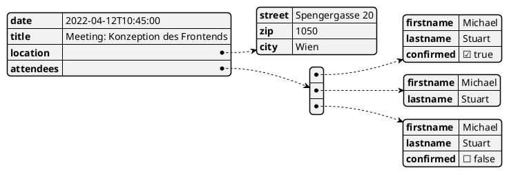

# JSON, Arrays und Sets

## Definition eines JSON Objektes

In Programmiersprachen mit static Typing wie C# oder Java unterscheidet man zwischen der
Definition und er Instanzierung eines Typs. So wird in Java z. B. zuerst eine Personenklasse
definiert, um sie dann mit *new* zu instanzieren:

```java
/* Person.java */
class Person {
    public String firstname;
    public String lastname;
    public Person(String firstname, String lastname) {
        this.firstname = firstname;
        this.lastname = lastname;
    }
}

/* Main method */
Person p = new Person("Max", "Mustermann");
System.out.println(p.lastname);
```

In einer Sprache mit weak typing wie JavaScript entfällt die Definition des Typs. Es können
komplexe Typen sofort initialisiert und zugewiesen werden:

```javascript
const p = {
    firstname: "Max",
    lastname: "Mustermann",
    age: 18,
    isFullAge: true    
};

console.log(p.lastname);     // Mustermann
console.log(p.Lastname);     // undefined (case sensitive)
p.lastname = "Other name";
console.log(p["lastname"]);  // Other name
console.log(p.notExisting);  // undefined
```

Es ist folgendes zu beachten: 

- Ein JSON Object beginnt mit `{` und endet mit `}`.
- Die einzelnen Properties werden mit dem Schema *key: value* definiert.
- Der Key muss eindeutig sein und darf nicht mit einer Zahl beginnen.
- Der Key muss nicht in Anführungszeichen stehen, wenn JSON zur Objektdefinition im Programmcode
  verwendet wird. Beim Datenaustausch und für *JSON.parse()* ist das Anführungszeichen (`"`) aber
  verpflichtend.
- Der Zugriff auf Properties erfolgt über den Punkt (.). Alternativ kann auch der Index ([]) mit
  einem String als Propertyname verwendet werden.
- Der Zugriff auf ein nicht existierendes Property liefert keinen Laufzeitfehler, sondern
  *undefined*.
- Die Werte sind JavaScript Literale. Es können wie im Kapitel Variablen die Grundtypen verwendet
  werden:
  - Null
  - Boolean
  - String (unter Anführungszeichen)
  - Number
  - Weitere JSON Objekte
  - Spezielle Objekte wie Arrays, Functions, etc.

### Verschachtelungen und Zugriff auf Properties

Ein JSON Objekt kann weitere Objekte als Property speichern. So ist folgende Definition möglich.

```javascript
const p = {
    firstname: "Max",
    lastname: "Mustermann",
    age: 18,
    isFullAge: true,
    address: {
        street: "My Street",
        zip: 1050,
        city: "Wien"
    }
};

console.log(p.address.city);  // Wien
```

### Hinzufügen und Löschen

Zusätzliche Properties können einfach zugewiesen werden. Um Properties zu löschen, wird der
Operator *delete* verwendet. Beachte, dass auch bei einer *const* Variablen die Änderung
möglich ist, da sich die Referenz, auf die p verweist, dadurch nicht verändert.

```javascript
const p = {
    firstname: "Max",
    lastname: "Mustermann",
    age: 18,
    isFullAge: true,
    address: {
        street: "My Street",
        zip: 1050,
        city: "Wien"
    }
};

p.email = "max@muster.at";
p.address.country = "Austria";
delete p.age;
console.log(p.email);         // max@muster.at
console.log(p.age);           // undefined
```

### Vergleiche von JSON Objekten

Wie in Java oder C# wird der == Operator die Referenzen der Objekte vergleichen. So liefert
die erste Ausgabe des folgenden Codes den Wert *false*:

```javascript
const p1 = { firstname: "Max" };
const p2 = { firstname: "Max" };
console.log(p1 == p2);                                 // false
console.log(JSON.stringify(p1));                       // {"firstname":"Max"}
console.log(JSON.stringify(p1) == JSON.stringify(p2)); // true
```

Mit *JSON.stringify()* steht eine Methode zur Verfügung, um ein JSON als String zurückzugeben.
Vergleichen wir beide Strings, liefert der Vergleich *true*. Dies kann natürlich nur angewandt
werden, wenn die Reihenfolge der Properties in der Definition auch exakt gleich ist.

### Vorsicht vor undefined

Existiert ein Property nicht, so wird *undefined* zurückgegeben. *undefined* ist ein eigener
Typ, der keinerlei Properties hat. Greifen wir aber auf weitere Properties (wie *city*) zu,
so ergibt sich ein Laufzeitfehler:

```javascript
const p = { firstname: "Max" };
console.log(p.lastname);        // undefined
console.log(p.address.city);    // TypeError: Cannot read properties of undefined (reading 'city')
```

Früher wurde oft die Typumwandlung in einen boolean
Wert verwendet. Bei undefined und null liefert die if Abfrage false, daher wird city nur ausgegeben,
wenn das Property *address* nicht *undefined*, *null*, ein Leerstring, 0 oder *false* ist.

```javascript
const p = { firstname: "Max" };
console.log(p.lastname);        // undefined
if (p.address) {
    console.log(p.address.city);    // undefined
}
```

Seit ES 11 (2020) gibt es sogenannte "optional chains". Wie in C# kann mit dem `?.` Operator
bedingt auf Properties zugegriffen werden.

```javascript
const p = { firstname: "Max" };
console.log(p.lastname);         // undefined
console.log(p.address?.city);    // undefined
```


### JSON als Austauschformat

Oftmals wird JSON als Austauschformat zwischen Systemen verwendet. Die Übertragung findet als
String statt, deswegen muss zuerst der String geparst werden. Mit *JSON.parse()* gibt es eine
eingebaute Methode dafür. Die Keys müssen unter doppelten Anführungszeichen stehen, sonst kann
der JSON String nicht geparst werden.

```javascript
// ES 6 template literal (backtick) to define multiline strings.
const fromApi = `{
    "firstname":"Max",
    "lastname":"Mustermann",
    "age":18,
    "isFullAge":true,
    "address":{
       "street":"My Street",
       "zip":1050,
       "city":"Wien"
    }
 }`;

const p = JSON.parse(fromApi);
console.log(p.lastname);
```

## Arrays

Wie in Java oder C# existieren in JavaScript auch Arrays. Sie können mit `[]` definiert und auch
initialisiert werden. Der Zugriff erfolgt auch über `[n]`.

```javascript
const names = ["Max", "Laura"];
console.log(names[0]);  // Max
console.log(names[2]);  // undefined
```

Arrays in JavaScript sind jedoch weitaus flexibler. Die Elemente müssen nicht den selben Typ
besitzen. Weiters ist die Größe veränderbar. Mit *push()* können Elemente hinzugefügt werden.
*splice(idx, count)* löscht *count* Elemente ab dem übergebenen Index (*idx*). Das folgende
Codebeispiel zeigt die Möglichkeiten:

```javascript
const values = ["A string", 12, { firstname: "Max" }];
console.log(values.length);        // 3
console.log(values[1].firstname);  // undefined
console.log(values[2].firstname);  // Max

values.push("New Item");
console.log(values.length, values);  // 4 [ 'A string', 12, { firstname: 'Max' }, 'New Item' ]

values.splice(0, 1);
console.log(values.length, values);  // 3 [ 12, { firstname: 'Max' }, 'New Item' ]

values[5] = "Index 5";
console.log(values.length, values);  // 6 [ 12, { firstname: 'Max' }, 'New Item', <2 empty items>, 'Index 5' ]
```

Bachte die letzte Anweisung. Ein Element wird an den Index 5 geschrieben. Das Array wird intern nun
auf 6 Stellen vergrößert. Der Index ist also immer durchgängig von 0...n verfügbar.

Wird ein Zugriff mit einem ungültigen Index durchgeführt, wird *undefined* geliefert. Es entsteht
kein Laufzeitfehler.

Häufig wird ein leeres Array zugewiesen, um dann mit *push()* dynamisch Elemente anhängen zu
können:

```javascript
const names = [];
names.push("Max");
```

> **Hinweis:** Die Möglichkeit, dass Arrays unterschiedliche Typen beinhalten können, sollte
> nicht (oder nur sehr selten) verwendet werden. Der Programmcode wird dadurch schwerer erweiterbar,
> da der Typ der Elemente nicht feststeht.

### Typed Arrays

Aus Performancegründen stellt ECMAScript 6 auch *typed Arrays* zur Abbildung von maschinennahen
Daten (int, double, ...) zur Verfügung. Sie sind in der Größe nicht veränderbar, d. h. es gibt
keine *push()* Methode.

Es gibt Objekte für Int8Array, Uint8Array, Uint8ClampedArray, Int16Array, Uint16Array, Int32Array,
Uint32Array, Float32Array und Float64Array.

```javascript
const int16Array = new Int16Array(3);
const initializedArrayByConstructor = new Int16Array([1, 2, 3]);

int16Array[0] = 12;
int16Array[1] = "A";       // no assignment
int16Array[2] = "1";       // conversion to 1
int16Array[3] = 2;         // will be ignored, no index 3
console.log(int16Array);   // [ 12, 0, 1 ]
```

## Set

Oftmals möchte man doppelte Werte in Arrays entfernen bzw. sie gar nicht erst ins Array aufnehmen.
Mit dem *Set* gibt e seine eigene Datenstruktur in JavaScript. Mit *add()* und *delete()* können
Elemente hinzugefügt bzw. gelöscht werden. Ist das Element bereits vorhanden, wird es nicht
hinzugefügt. Das folgende Beispiel zeigt die Verwendung eines Set:

```javascript
const mySet = new Set();
const json1 = {x: 1};
const json2 = {x: 1};

mySet.add("1");
mySet.add(1);
mySet.add(1);        // Not added
mySet.add(json1);
mySet.add(json1);    // Not added
mySet.add(json2);    // Added
console.log(mySet);  // { '1', 1, { x: 1 }, { x: 1 } }
mySet.delete("1");

const setFromArray = new Set([1, 2, 3, 1]);
console.log(setFromArray)  // { 1, 2, 3 }
```

Beachte, dass beim Vergleich keine Typumwandlung stattfindet. So ist in diesem Beispiel der String
"1" und die Zahl 1 im Set. Bei JSON Objekten gilt der Referenzvergleich.

## Iterieren mit for...of und for...in

In Java gibt es mit `for(int elem : array)` die Möglichkeit, eine Collection zu durchlaufen. In
C# geschieht dies mit `foreach`. In JavaScript gibt es sogar zwei Möglichkeiten: Die *for...in* und
*for...of* Schleife.

Die *for...in* Schleife liefert alle *Properties* eines Objektes. Im Falle von Arrays ist dies der Index,
bei JSON Objekten wird der Propertyname geliefert. Über diesen Key kann dann auf das Element
zugegriffen werden.

Speziell für Arrays und Sets (exakter: iterierbare Objekte) gibt es die *for...of* Schleife.
Sie speichert alle *Werte* in eine Variable. Der Zugriff über den Index entfällt.

```javascript
const values = ["A string", 12, { firstname: "Max" }];
const myJson = { firstname: "Max", lastname: "Mustermann" };

// 0, 1, 2
for (const value in values) {
    console.log(value);
}

// firstname, Max
// lastname, Mustermann
for (const key in myJson) {
    console.log(key, myJson[key]);
}

// "A string", 12, { firstname: "Max" }
for (const value of values) {
    console.log(value);
}

// TypeError: myJson is not iterable
for (const value of myJson) {
    console.log(value);
}
```

Wie im Beispiel erkennbar können mit *for...in* alle Properties eines JSON Objektes durchwandert
werden. Ein JSON Objekt ist nicht iterierbar, d. h. die Verwendung von *for...of* führt zu einem
Laufzeitfehler.

## Übung

Das folgende Diagramm zeigt ein JSON Object. Definiere dieses Objekt in JavaScript
und speichere es in der Variable Student.



