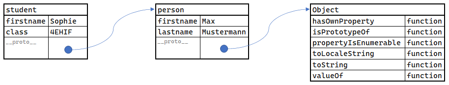
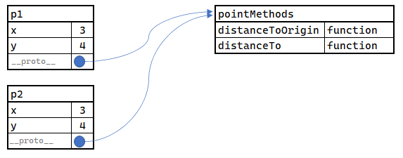
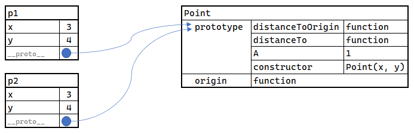
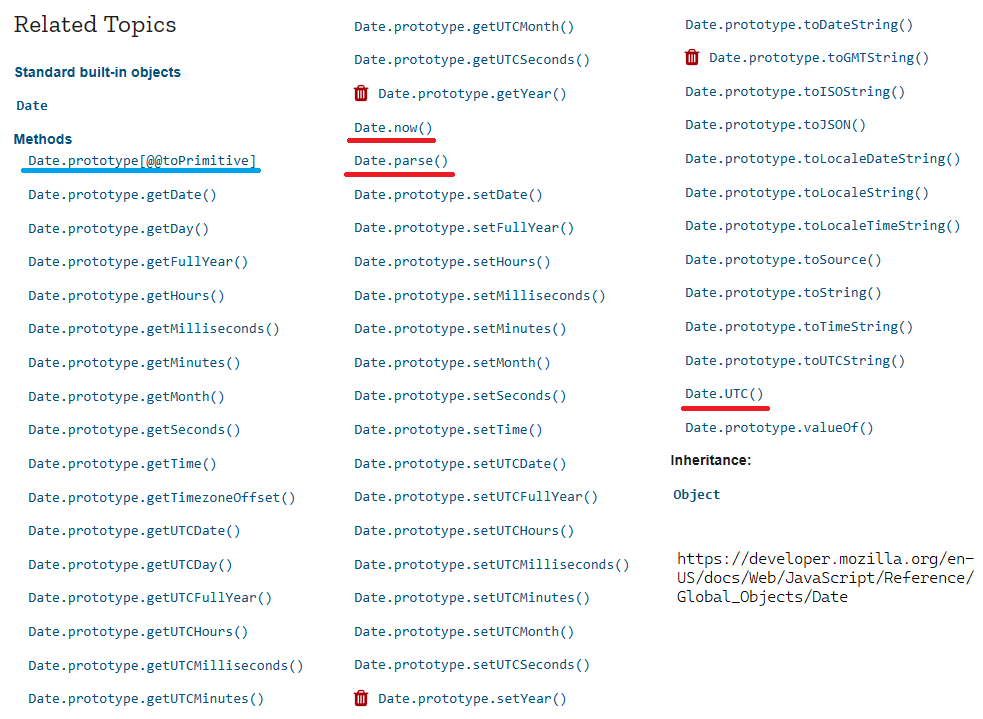

# Funktionen 2: Prototype, this und new

## this

Das Schlüsselwort *this* ist aus anderen Sprachen wie Java oder C# bekannt. Es ist eine Referenz
auf die Instanz einer Klasse. JavaScript basiert auf Funktionen, deswegen müssen wir dieses
Schlüsselwort genauer betrachten.

Im ECMAScript Sprachstandard ist *this* definiert:

> When a function is called as a method of an object, the object is passed to the function as its
> this value.
> <sup>https://262.ecma-international.org/6.0/#sec-method</sup>

Hier ist die Aussage *When a function is called as a method of an object* wichtig. Betrachten wir
folgenden Code:

```javascript
"use strict"
function myFunction() {
    console.log(this);    // undefined
}

myFunction();
```

*myFunction()* wird nicht als Methode eines Objektes aufgerufen, sie ist direkt in der Datei
definiert. Daher hat *this* keinen Wert (undefined). Der String *use strict* weist Node.js
an, das exakte ECMAScript Verhalten zu zeigen. Würden wir es weglassen, wird *this* auf das
global object von Node gesetzt.

*this* wird daher meist
- in Funktionen,
- die innerhalb von Objekten definiert sind
verwendet. Es erlaubt den Zugriff auf andere Properties.

Definieren wir also ein JSON Objekt mit einer Funktion:

```javascript
const person = {
    firstname: "Max",
    lastname: "Mustermann",
    longnane: this.firstname + " " + this.lastname,    // !! undefined !!
    getLongname() {
        return this.firstname + " " + this.lastname;
    }
}

console.log(person.longname);       // undefined
console.log(person.getLongname());  // Max Mustermann
```

Die erste Ausgabe liefert undefined, da das Property *longname* keine Funktion ist. Daher ist
*this* dort nicht definiert. Verwenden wir eine Funktion (*getLongname()*), so können wir mit
*this* auf die Properties des JSON Objektes zugreifen.

## Object.create() und der Prototype

Jedes Objekt in JavaScript hat ein verstecktes Property, welches bis jetzt noch nicht in
Erscheinung getreten ist: den *Prototype*. Ein Prototyp ist im Sprachgebrauch eine Vorlage,
aus der neue Dinge erzeugt werden. Betrachten wir folgendes Codebeispiel:

```javascript
const person = {
    firstname: "Max",
    lastname: "Mustermann"
};
const student = Object.create(person);
student.firstname = "Sophie";
student.class = "4EHIF";

console.log(person.firstname, person.lastname);                  // Max Mustermann
console.log(student.firstname, student.lastname, student.class); // Sophie Mustermann 4EHIF
console.log(student.__proto__.firstname);                        // Max
console.log(Object.getPrototypeOf(student).firstname);           // Max
```

*Object.create()* erzeugt keine Kopie von person, sondern es geht anders vor: Es wird ein neues
Objekt erzeugt, dessen Property *prototype* auf das Basisobjekt (die Person) zeigt. Danach
wird *firstname* und *class* zugewiesen. Im Speicher sieht es nun so aus:



Die Besonderheit des *prototype* Properties liegt in der Behandlung durch JavaScript. Geben wir
das Property *firstname* aus, sucht JavaScript zuerst im *student* Objekt nach diesem Property und
findet einen Wert. *lastname* ist allerdings nicht in *student* definiert. Also sucht JavaScript
automatisch im referenzierten Objekt des prototype Properties. Dadurch kommt es auf die Person und
kann den Namen ausgeben.

Wir haben durch dieses Verhalten also Vererbung quasi nachgebildet. Allerdings ist es nicht
empfehlenswert, OOP Wissen auf JavaScript umzulegen. Auch wenn manche Features das gleiche
Verhalten zeigen, sind die Grundmechanismen anders und müssen verstanden werden.

Das Property *\_\_proto\_\_* sollte nicht direkt verwendet werden. Für den Zugriff gibt es die
Methode *Object.getPrototypeOf()*.

Auch der Prototype von *person* zeigt auf ein Objekt. Dadurch kann bei jedem Objekt z. B.
*toString()* aufgerufen werden. JavaScript geht alle Prototypes auf der Suche nach
Properties oder Methoden durch. Dies bezeichnet man als *prototype chaining*.

## Der Prototype bei Funktionen

Das Konzept des Prototypes lässt sich auch auf Funktionen umlegen. Wir wissen bereits, dass
Funktionen Objekte zurückliefern können, und dass Objekte auch Funktionen definieren können.
Somit können wir z. B. eine *point()* Funktion definieren, die ein initialisiertes JSON Objekt
zurückliefert. Dieses Objekt repräsentiert einen Punkt.

Die Methoden *distanceToOrigin()* und *distanceTo()* könnten auch direkt auf x zugreifen. Wir
verwenden in diesem Beispiel den Zugriff auf das JSON Objekt.

Um die Argumente zu Prüfen wird der Umstand genutzt, dass die Zuweisung das Ergebnis auch
zurückliefert. Somit kann in einem Schritt das Argument in eine Zahl umgewandelt werden und
ein Fehler geworfen werden, wenn das Argument keine Zahl ist.

```javascript
function point(x, y) {
    if (!isFinite(x = Number(x))) { throw new TypeError("x is not a number"); }
    if (!isFinite(y = Number(y))) { throw new TypeError("y is not a number"); }
    return {
        x: x,
        y: y,
        distanceToOrigin() {
            return Math.sqrt(this.x * this.x + this.y * this.y);
        },
        distanceTo(point) {
            return Math.sqrt((point.x - this.x) * (point.x - this.x) + (point.y - this.y) * (point.y - this.y));
        }
    }
}

const p1 = point(3, 4);
const p2 = point(5, 12);

console.log(p1.distanceToOrigin());   // 5
console.log(p2.distanceToOrigin());   // 13
console.log(p1.distanceTo(p2));       // 8.246
```

Das Ergebnis ist wie erwartet und funktioniert. Doch was passiert im Speicher? Angenommen es werden
10&puncsp;000 Punkte erstellt. Dadurch entstehen 10&puncsp;000 JSON Objekte, die auch die Funktionen
beinhalten. Das bedeutet, dass der Code für die Berechnung der Distanz auch 10&puncsp;000 mal im
Speicher vorhanden ist!

Mit dem Wissen über Prototypes und *Object.create()* können wir die Methoden auslagern und nur darauf
referenzieren: 

```javascript
const pointMethods = {
    distanceToOrigin() {
        return Math.sqrt(this.x * this.x + this.y * this.y);
    },
    distanceTo(point) {
        return Math.sqrt((point.x - this.x) * (point.x - this.x) + (point.y - this.y) * (point.y - this.y));
    }
};

function point(x, y) {
    if (!isFinite(x = Number(x))) { throw new TypeError("x is not a number"); }
    if (!isFinite(y = Number(y))) { throw new TypeError("y is not a number"); }

    let pointData = Object.create(pointMethods)
    pointData.x = x;
    pointData.y = y;
    return pointData;
}

const p1 = point(3, 4);
const p2 = point(5, 12);

console.log(p1.distanceToOrigin());   // 5
console.log(p2.distanceToOrigin());   // 13
console.log(p1.distanceTo(p2));       // 8.246
```

Im Speicher muss der Code der Funktionen nur ein mal gespeichert werden, da jeder erstellte Punkt
nur darauf über den Prototypen referenziert:



Das händische Trennen ist allerdings mühsam. Deswegen gibt es in ECMAScript den *new* Operator und
sogenannte *constructor functions*. Der Sprachstandard gibt schon Aufschluss über die Verwendung:

> Even though ECMAScript includes syntax for class definitions, ECMAScript objects are not fundamentally class-
> based such as those in C++, Smalltalk, or Java. Instead objects may be created in various ways including via a
> literal notation or via constructors which create objects and then execute code that initializes all or part of them
> by assigning initial values to their properties. Each constructor is a function that has a property named
> "prototype" that is used to implement prototype-based inheritance and shared properties. Objects are
> created by using constructors in new expressions; for example, new Date(2009,11) creates a new Date
> object. Invoking a constructor without using new has consequences that depend on the constructor. For
> example, Date() produces a string representation of the current date and time rather than an object.
> <sup>https://262.ecma-international.org/6.0/#sec-objects</sup>


Mit dem Schlüsselwort *new* wird die nachfolgende Funktion als *Konstruktorfunktion* behandelt.
Es wird ein neues Objekt erzeugt, und der Code der Funktion wird ausgeführt. Dieses erzeugte
Objekt hat ein eigenes Property *prototype*, welches zugänglich ist.

Betrachten wir folgenden Code:

```javascript
"use strict"
function Point(x, y) {
    if (!isFinite(x = Number(x))) { throw new TypeError("x is not a number"); }
    if (!isFinite(y = Number(y))) { throw new TypeError("y is not a number"); }
        
    if (!(this instanceof Point)) {
        return `${x} | ${y}`;
    }
    this.x = x;
    this.y = y;
}

Point.origin = function () {
    return new Point(0, 0);
}
Point.prototype.distanceToOrigin = function () {
    return Math.sqrt(this.x * this.x + this.y * this.y);
};

Point.prototype.distanceTo = function (point) {
    return Math.sqrt((point.x - this.x) * (point.x - this.x) + (point.y - this.y) * (point.y - this.y));
};

Point.prototype.A = 1;

const pWithoutNew = Point(3, 4);
const p1 = new Point(3, 4);
const p2 = new Point(5, 12);
console.log(pWithoutNew);                    // "3 | 4"
console.log(p1.distanceToOrigin());          // 5
console.log(p2.distanceToOrigin());          // 13
console.log(p2.distanceTo(p1));              // 8.246
console.log(p2.distanceTo(Point.origin()));  // 13
console.log(p1.A);                           // 1
console.log(p2.A);                           // 1
```

Zuerst wird eine "normale" Funktion *Point()* definiert. Die Großschreibung deutet bereits darauf
hin, dass sie als Konstruktorfunktion verwendet werden kann. Durch den *new* Operator wird *this*
auf das neu erzeugte Objekt gesetzt. Dadurch können wir 2 Properties (x und y) zuweisen.

Nachdem wir die Funktion definiert haben, schreiben wir in ein Property namens *prototype* 
Eigenschaften und Methoden.
Das ist nicht der Prototype von Point, denn er wäre mit
*Object.getPrototypeOf()* zugreifbar. Es ist einmal ein normales, leeres Objekt welches wir
mit Eigenschaften und Methoden versehen. Zudem können wir z. B. mit *Point.origin* auch direkt
Properties zu Point zuweisen. Auf diesem Wege können wir quasi statische Funktionen definieren.
Sie werden dann mit *Point* direkt aufgerufen.

Im Gegensatz zur Klassendefinition (siehe nächstes Kapitel) wird die Verwendung von *new* nicht
erzwungen. Die Funktion kann auch als "normale" Funktion aufgerufen werden. Die Zeile 
*const pWithoutNew = Point(3, 4);* zeigt so einen Aufruf. Hier wird einfach der Rückgabewert - 
also ein String - in die Variable pWithoutNew geschrieben. Das ist auch die Ursache, warum wir
*Number("1")* als Funktion verwenden können, obwohl sie auch Objekte erzeugen kann. Es wird
dann die umgewandelte Zahl und kein Objekt geliefert.

Durch die Verwendung von *new* wir dann ein Objekt erstellt, dessen Prototype auf das Property
*prototype* von Point zeigt:



Die Funktion *constructor* wird automatisch bei Funktionen angelegt. Dadurch können wir den
*new* Operator auch nachbilden:

```javascript
const p1 = Object.create(Point.prototype);
p1.constructor(3, 4);
console.log(p1.distanceToOrigin());           // 5
```

> **Hinweis:** In ECMAScript 6 werden Klassen mit dem Schlüsselwort *class* definiert. Es erzwingt
> die Verwendung von *new*. Ein vergessenes *new* war früher eine häufige Fehlerquelle. Dieses
> Kapitel ist aber zum Grundverständnis sehr wichtig, da Klassen lediglich eine syntaktische
> Umsetzung des Prototype Konzeptes sind.

## Interpretation der MDN Dokumentation

Auf https://developer.mozilla.org/en-US/docs/Web/JavaScript/Reference/Global_Objects/Date befindet
sich die Referenz des *Date* Objektes. Die Methoden sind links aufgelistet:



Es fallen verschiedene Arten der Definition auf:
- Manche Funktionen oder Properties sind direkt bei *Date* definiert (rot unterstrichen). Sie
  können z. B. direkt mit *Date.new()* aufgerufen werden. Es handelt sich meist um factory
  Methoden. Sie entsprechen statischen Methoden in der OOP Programmierung.
- Die meisten Methoden sind an den *prototype* gebunden. Sie können nur bei einer über *new*
  erstellten Instanz verwendet werden.
- Das Symbol \[@@toPrimitive\] ermöglicht eine Umwandlung in einen primitiven Typ wie String
  oder Number. Dadurch wird z. B. mit `d - 1` der Zeitstempel 1 ms vor der Date Instanz d geliefert.
  Dadurch können Objekte in Berechnungen verwendet werden. In C# gibt es durch Überladung des
  *implicit* Operators auch solche Techniken.

## Übung

Es können auch bei bestehenden Objekten wie z. B. *Date* Funktionen und Properties hinzugefügt werden.
Füge zum *Date* Objekt 2 Methoden hinzu:
- *schoolyearBegin(year)* liefert ein Date Objekt, welches den ersten Montag im September liefert.
- *toGermanDateString()* soll die aktuelle Instanz als deutsches Datum (DD.MM.YYYY) ausgeben.

Erstelle dafür eine neue Datei *date_exercise.js*. Kopiere den untenstehenden Code in diese Datei.
Mit *node date_exercise.js* kann die Datei in der Konsole von VS Code ausgeführt werden. Beachte
die folgenden Hinweise:
- Überlege, ob Date selbst oder der prototype erweitert werden soll.
- Mit `("00" + myVal).slice(-2)` kann eine ganze Zahl in einen String mit führender 0 umgewandelt
  werden. *slice(-2)* liefert die rechten 2 Stellen zurück. So wird z. B. aus 1 der String "001" und
  nach *slice(-2)* der String "01".
- Beachte, dass *Date.prototype.getMonth()* die Monate bei 0 zu zählen beginnt. Auch der Konstruktor
  von Date *Date(year, month, day)* erwartet das Monat beginnend mit 0.
- *Date.prototype.getDay()* liefert den Wochentag, *Date.prototype.getDate()* den Tag des Monats.
- *Date.prototype.getFullYear()* liefert das Jahr.

**date_exercise.js**
```javascript
/* Your implementation */

for(let year = 2020; year < 2040; year++) {
    const date = Date.schoolyearBegin(year);
    console.log(date.toGermanDateString());
}
```

**Ausgabe**
```text
07.09.2020
06.09.2021
05.09.2022
04.09.2023
02.09.2024
01.09.2025
07.09.2026
06.09.2027
04.09.2028
03.09.2029
02.09.2030
01.09.2031
06.09.2032
05.09.2033
04.09.2034
03.09.2035
01.09.2036
07.09.2037
06.09.2038
05.09.2039
```


## Übung 2

Implementiere eine Lottoziehung. Bei einer Lottoziehung werden eindeutige Werte zwischen 1 und
45 gezogen. Verwende daher zum Speichern der gezogenen Zahlen und des einzelnen Tipps ein Set.
Auf https://developer.mozilla.org/en-US/docs/Web/JavaScript/Reference/Global_Objects/Set kannst
du die Methoden, die es bietet, nachlesen.

Erweitere zuerst das Set, sodass es eine Methode *countIdentical(other)* besitzt. Es wird die
Anzahl der Werte, die sowohl im eigenen Set als auch in *other* enthalten sind, zurückgegeben.

Danach implementiere die Konstruktorfunktion *Lottery(number)*. Die gezogenen Zahlen werden
als Array übergeben. Der Konstruktor von Set kann das Array in ein Set umwandeln. Verwende
zur Speicherung der Tipps ein Array von Sets.

Die Methode *addTipp* fügt nur Tipps hinzu, die 6 unterschiedliche Werte haben. Die Methode
*getStatistics* liefert ein JSON Objekt mit der Anzahl der übereinstimmenden Zahlen als Key und
der Anzahl der gespeicherten Tipps als Wert.

Erstelle eine neue Datei *lottery.js* und kopiere den untenstehenden Code hinein. Die korrekte
Ausgabe muss der unten angezeigten Ausgabe entsprechen. Führe das Programm mit *node lottery.js*
in der Konsole von VS Code aus.

**lottery.js**
```javascript
/* Your implementation of countIdentical */

/* Your implementation of Lottery */

/* Test */
const set1 = new Set([1, 2, 3, 4, 5, 6]);
const set2 = new Set([1, 3, 5, 7, 9, 11, 6]);
console.log(`${set1.countIdentical(set2)} identical values.`);

const lottery = new Lottery([13, 30, 1, 40, 41, 38]);
const tipps = [
    [13, 30, 1, 40, 41],       // ignore (does not have 6 numbers)
    [13, 30, 1, 40, 41, 41],   // ignore (does not have 6 numbers because of the double values)
    [38, 41, 40, 1, 30, 13],   // 6
    [45, 13, 30, 1, 40, 41],   // 5
    [45, 44, 13, 30, 1, 40],   // 4
    [45, 44, 43, 13, 30, 1],   // 3
    [45, 44, 43, 42, 13, 30],  // 2
    [45, 44, 43, 42, 39, 13],  // 1
    [45, 44, 43, 42, 39, 37],  // 0
    [45, 44, 43, 42, 39, 37]   // 0
]
for (const t of tipps) { lottery.addTipp(t) };
const statistics = lottery.getStatistics();
console.log(statistics);
```

**Ausgabe**
```text
4 identical values.
{ '0': 2, '1': 1, '2': 1, '3': 1, '4': 1, '5': 1, '6': 1 }
```
