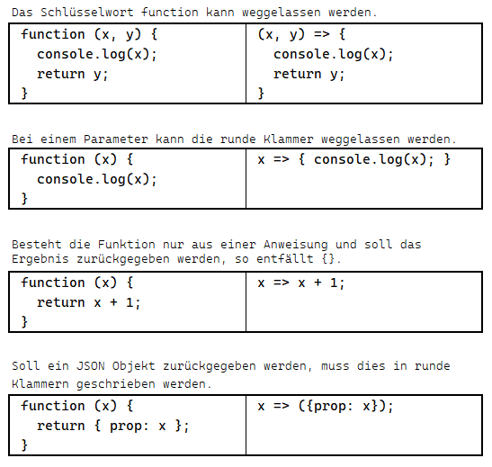
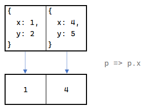
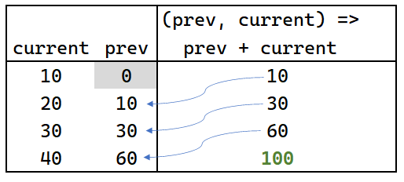
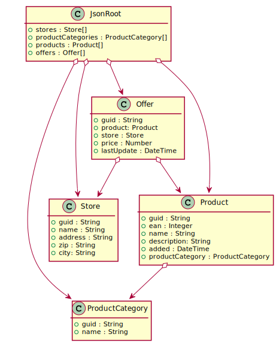

# Funktionen 3: Arrow functions und Arraymethoden

Aus den vorigen Kapitel wissen wir bereits, dass Funktionen wie Objekte in Variablen gespeichert
werden können. Außerdem können Funktionen auch als Parameter übergeben werden.

```javascript
function divide(x, y, error) {
    x = Number(x);
    y = Number(y);
    if (y == 0) { error("Divide by zero"); }
}

function log(message) {
    console.log(message);
}

const result = divide(3, 0, log);  // Divide by zero
```

Um die Funktion, die im Fehlerfall von *divide()* aufgerufen wird zu definieren, müssen wir uns einen
Namen überlegen und diese Funktion extra definieren.

Der Name der Funktion ist allerdings nicht wichtig, da sie sowieso als Parameter übergeben wird.
Für diese Fälle wurden *arrow functions* in ECMAScript 6 eingeführt. Wir können Funktionen in einer
kürzeren Schreibweise definieren:



Unsere Funktion *log()* kann daher als arrow function umgeschrieben werden:
```javascript
message => { console.log(message) }
```

Das macht den nachfolgenden Code kürzer:

```javascript
function divide(x, y, error) {
    x = Number(x);
    y = Number(y);
    if (y == 0) { error("Divide by zero"); }
}

const result = divide(3, 0, message => { console.log(message) });  // Divide by zero
```

## Callback Methoden als Filterfunktionen

Besonders im Zusammenhang mit Arrays zeigt sich die Flexibilität der arrow functions. Bis jetzt
bearbeiteten wir Arrays immer *imperativ* mit *for...of* Schleifen. Nun ergänzen wir eine Methode
*filter* (so wie Where in LINQ aus C#). Die Idee ist folgende: Der grundsätzliche Ablauf einer
Filterung ist immer der Gleiche. Wir gehen durch das Array durch und entscheiden anhand eines
Kriteriums mit if, ob das Element im Ergebnis ist.

Wir können diese Entscheidung aber "auslagern". Der Aufrufer soll uns einfach eine Funktion
übergeben, die entscheidet, ob ein Wert genommen werden soll. Natürlich muss die Funktion einen
Wert vom typ boolean zurückgeben und einen Parameter (das aktuelle Element) erhalten.

Eine filter Funktion, die das bestehende Array Objekt erweitert, könnte so aussehen:

```javascript
Array.prototype.filter = function (predicate) {
    const result = [];
    for (const element of this) {
        if (predicate(element)) {
            result.push(element)
        }
    }
    return result;
}

console.log([1, 2, 3].filter(x => x < 3));  // [1, 2]
```

Die filter Funktion ist gänzlich unabhängig vom Inhalt des Arrays. **Dadurch gibt es sie sogar schon
im ECMAScript Sprachstandard und muss nicht implementiert werden!** Löschen wir die Definition von
*filter()* aus dem Code, funktioniert dieser weiterhin. Nur wird jetzt die eingebaute Funktion
*filter()* verwendet.

In LINQ (.NET Framework) heißt diese Funktion *Where()*. In Java Streams heißt sie auch *filter()*.

## Arrayfunktionen zur funktionalen Bearbeitung von Arrays

- **filter(predicate)** liefert ein Array mit allen Elementen zurück, bei denen die übergebene
  Funktion *predicate* true liefert.
- **find(predicate)** liefert das erste Element zurück, bei dem die übergebene Funktion *predicate*
  true liefert. Liefert *undefined*, falls kein Wert gefunden wurde.
- **map(projection)** liefert ein Array zurück, das aus den Rückgabewerten der Funktion *projection*
  besteht. Es hat immer gleich viele Elemente wie das originale Array.
- **forEach(action)** führt die übergebene Funktion *action* für jedes Element im Array aus. Gibt
  nichts zurück.
- **reduce(aggregator, startVal)** übergibt beim ersten Element *startVal* und das aktuelle
  Element der Funktion *aggregator*. Bei weiteren Elementen wird immer das aktuelle Element und
  der vorige Wert der aggregator Funktion übergeben.

## Projektion mit map()

Projektionen werden dann verwendet, um alle Elemente in einem Array "umzuwandeln". Das folgende
Beispiel soll ein Array von x Koordinaten aus einem Array von Punkten erstellen. Grafisch lässt
sich die Projektion wie folgt darstellen:



Wir erkennen, dass das Ergebnis stets die selbe Anzahl an Elementen hat. Die Projektionsfunktion
`p => p.x` wird für jedes Element durchgeführt. Der Parameter *p* wird mit jedem Element belegt.
Der Parameter kann beliebig benannt werden. Eine Bezeichnung mit dem ersten Buchstaben des Quelltyps
(hier Point) ist aber an Besten nachzuvollziehen.

Im Code sieht die Projektion nun so aus:

```javascript
const points = [
    { x: 1, y: 2 },
    { x: 4, y: 5 }
];

const xValues = points.map(p => p.x);
console.log(xValues);                  // [3, 4]
const pointStrings = points.map(p => `X = ${p.x} | Y = ${p.y}`);
console.log(pointStrings);            // [ 'X = 1 | Y = 2', 'X = 4 | Y = 5' ]

// Projection functions without a return value are useless...
const useless = points.map(p => { p.x + p.y });
console.log(useless);                 // [ undefined, undefined ]
```

Der letzte Fall (kein Rückgabewert) ist ein häufiger Fehler. Hier wurde ein Anweisungsblock
mit `{ }` in der arrow function erstellt. Dadurch liefert die Funktion nichts zurück und es entsteht
ein Array bestehend aus *undefined* Elementen.

In LINQ (.NET Framework) wird diese Methode auch als *Select()* bezeichnet. In Java Streams heißt
die Funktion ebenfalls *map()*.


## Reduce

Am Schwierigsten ist sicher die Funktion *reduce()* zu verstehen. Reduce erwartet sich als erstes
Argument eine Funktion mit 2 Parametern (aggregate function): *prev* und *current*.
*prev* wird mit dem vorigen Wert der aggregate function befüllt. *current* wird mit dem aktuellen
Wert aus dem Array befüllt.

Beim ersten Element hat der Wert *prev* noch keinen Wert, da die aggregate function noch nie
ausgeführt wurde. Deswegen brauchen wir einen *Startwert*. Dieser Wert ist das zweite Argument
der Funktion *reduce*.

Grafisch können wir die Summe aus allen Elementen wie folgt bilden:



Der dazugehörige Code ist - wenn man die Methode erst einmal verstanden hat - sehr einfach:
```javascript
const numbers = [10, 20, 30, 40];

const sum = numbers.reduce((prev, current) => prev + current, 0);
console.log(sum);                 // 100
```

### Praxisbeispiel: Gruppieren mit reduce

Gruppierungen haben auf den ersten Blick nichts mit *reduce()* zu tun, lassen sich aber damit
umsetzen. Betrachten wir ein Array von Messwerten:

```javascript
const values = [
    { id: "1001", tmax: 3.2, date: "2021-12-24" },
    { id: "1002", tmax: 0.5, date: "2021-12-24" },
    { id: "1001", tmax: 1.6, date: "2021-12-25" },
    { id: "1002", tmax: 4.6, date: "2021-12-25" },
    { id: "1001", tmax: 4.3, date: "2021-12-26" },
    { id: "1002", tmax: 3.4, date: "2021-12-26" },
];
```

Nun wollen wir pro ID ein Array mit den Werten erzeugen. Dadurch verwenden wir folgende Technik:

- Wir beginnen mit einem leeren Object (`{ }`) als Startwert.
- Wenn der Key mit der id noch nicht angelegt wurde wird ein leeres Array zugewiesen.
- Über den Zugriff mit der id als Key können wir leicht das Element finden und den Messert hinzufügen.
- Da die arrow function aus mehreren Statements besteht, müssen wir die Referenz auf das Objekt
  zurückgeben.

Konkret sieht dies so aus:

```javascript
const grouped = values.reduce((prev, current) => {
    if (!prev[current.id]) { prev[current.id] = []; }
    prev[current.id].push(current);
    return prev; // !! important !!
}, {})


// {
//     '1001': [
//       { id: '1001', tmax: 3.2, date: '2021-12-24' },
//       { id: '1001', tmax: 1.6, date: '2021-12-25' },
//       { id: '1001', tmax: 4.3, date: '2021-12-26' }
//     ],
//     '1002': [
//       { id: '1002', tmax: 0.5, date: '2021-12-24' },
//       { id: '1002', tmax: 4.6, date: '2021-12-25' },
//       { id: '1002', tmax: 3.4, date: '2021-12-26' }
//     ]
// }
console.log(grouped);
```

Sind wir nur an den unterschiedlichen IDs interessiert, können wir das übrigens mit dem Set und
*map()* erledigen. *Array.from()* erzeugt aus jeder Collection wiederum ein Array.

```javascript
const ids = Array.from(new Set(values.map(v => v.id)));
console.log(ids);
```

## Iterieren mit forEach()

Möchten wir die Messwerte aus dem vorigen Beispiel ausgeben, können wir natürlich mit 
*for...of* durchgehen.

```javascript
for(const v of values) {
    console.log(`${v.id} lieferte den Wert ${v.tmax}°.`);
}
```

Einen funktionale Ansatz bietet die Funktion *forEach()*:

```javascript
// 1001 lieferte den Wert 3.2°.
// 1002 lieferte den Wert 0.5°.
// 1001 lieferte den Wert 1.6°.
// 1002 lieferte den Wert 4.6°.
// 1001 lieferte den Wert 4.3°.
// 1002 lieferte den Wert 3.4°.
values.forEach(v => console.log(`${v.id} lieferte den Wert ${v.tmax}°.`));
```

*forEach()* liefert nichts zurück. Soll für jedes Element eine Funktion aufgerufen und das Ergebnis
des Aufrufes weiter bearbeitet werden, ist *map()* zu verwenden.

## Verknüpfen der Funktionen

Nun möchten wir die Messwerte vor dem 26.12.2021 ausgeben. Da das Datum als String vorliegt, wird
es zuerst in ein *Date* Objekt umgewandelt. Danach wird gefiltert und mit *forEach()* jeder Wert
ausgegeben.

```javascript
const values = [
    { id: "1001", tmax: -3.2, date: "2021-12-24" },
    { id: "1002", tmax: -0.5, date: "2021-12-24" },
    { id: "1001", tmax: 1.6, date: "2021-12-25" },
    { id: "1002", tmax: 4.6, date: "2021-12-25" },
    { id: "1001", tmax: 4.3, date: "2021-12-26" },
    { id: "1002", tmax: -3.4, date: "2021-12-26" },
];

const dateTo = new Date("2021-12-26");

const temperatures = values
    .map(v => {
        v.date = new Date(v.date);
        v.iceDay = v.tmax < 0;
        return v;   // !! important !!
    })
    .filter(v => v.date < dateTo);

// Fri Dec 24 2021: -3.2°
// Fri Dec 24 2021: -0.5°
// Sat Dec 25 2021: 1.6°
// Sat Dec 25 2021: 4.6°
temperatures.forEach(v => console.log(`${v.date.toDateString()}: ${v.tmax}°`));

// Days with tmax < 0°. Do not count a day more than once.
const iceDays = new Set(temperatures.filter(t => t.iceDay).map(t => t.date)).size;
console.log(iceDays);           // 2
```

Beachte auch hier, dass die map Funktion aus mehreren Anweisungen besteht und wir mit return
einen Wert zurückgeben müssen. In diesem Fall verändern wir das originale JSON Objekt. Über
Closures können wir in der arrow function auf den Wert von *dateTo* zugreifen.

Damit die Anzahl der Eistage (Tage mit einer Höchsttemperatur \< 0°) korrekt ausgegeben wird,
müssen wir ein Set generieren und die Anzahl der Elemente zählen.

## Übung

### Aufbau der Daten (JSON)

Die Datei [stores.json](stores.json) ist eine JSON Datei, die - ähnlich wie Geizhals -
verschiedene Shops speichert. Daneben gibt es eine Liste an Produkten.
Die Produkte werden in Shops angeboten. Diese Angebote werden als Offer gespeichert.

Die Datei ist UTF-8 codiert (ohne Byte Order Mark).

Das folgende Diagramm zeigt die Struktur der Datei. Das oberste Objekt ist *JsonRoot*, es
repräsentiert die oberste Ebene der Datei.


<sup>
https://www.plantuml.com/plantuml/uml/ZPAzJiCm4CTtFuLtr1TWG9LWWG4G7nDYCF4rjHJx8jzb22ZlZfEJ8-Csg9sidw__Zvptn2Rou3jrT1Oq-9v7xO6FQ4ardI7I3uJX1P7rZzBfTqMC4KXVwzVvyF4fj8zeXuPl3KEBqIq3pt_OM8qM4_a63mU8Ct-Q3ubEQdN7tUv6B2jMkPo_hUYYhwIWYEPsxU3iqYswq0eAnaE5ZBKHY2hwxVgAD8x7bKpPi4fyiNKjyCyVmOH4xaDoWBXPmm8rqVNiC9pqWrdopZ2yEG_dTZoURZWb5BAn6ealNtyxVFPPvOjtbvzT7dJDZ1u7_vLh9WT-xssoBFDFIapBM2KIqJq4E_Zk5m00
</sup>

Erstelle eine neue Datei *data_analyze.js*. Lade die Datei [stores.json](stores.json) in den
selben Ordner wie *data_analyze.js*. Kopiere danach den Inhalt des untenstehenden Skripts
in die Datei. Weise deine Lösung der Variable *result* statt dem leeren Array zu.

**data_analyze.js**
```javascript
const fs = require('fs');
const rawdata = fs.readFileSync('stores.json');
const data = JSON.parse(rawdata);

// *************************************************************************************************
// MUSTERBEISPIELE
// *************************************************************************************************

// Wie viele Stores sind in der Datei?
{ // To limit scope of variables.
    const result = data.stores.length;
    console.log("Muster: Wie viele Stores sind in der Datei?");
    console.group();
    console.log(result);
    console.groupEnd();
}


// Welche Produkte sind in der Kategorie Fantastic und haben eine EAN Nummer > als 700000?
// Gib EAN und den Namen aus.
{
    const result = data.products
        .filter(p => p.productCategory.name == "Fantastic" && p.ean > 700000)
        .map(p => ({
            ean: p.ean,
            name: p.name,
        }));
    console.log("Muster: Produkte in der Kategorie Fantastic und EAN > 700000.");
    console.group();
    console.table(result);
    console.groupEnd();
}

// *************************************************************************************************
// ÜBUNGEN
// *************************************************************************************************

// (1) Welche Stores sind in 1050 oder 1110 Wien? Filtere nach der Postleitzahl.
{
    const result = [];
    console.group();
    console.table(result);
    console.groupEnd();
}

// (2) In welchen Postleitzahlen existieren Stores? Verwende ein Set zur Entfernung der doppelten
// Werte.
{
    const result = [];
    console.log("(2) PLZ mit Stores.");
    console.group();
    console.log(result);
    console.groupEnd();
}

// (3) Erstelle ein Array mit EAN, Name und Kategorie der Produkte, die vor dem 15. Februar 2021
// hinzugefügt wurden. Hinweis: Du kannst < auch bei Datestrings verwenden.
{
    const result = [];
    console.log("(3) Produkte, die vor dem 15. Februar 2021 hinzugefügt wurden.");
    console.group();
    console.table(result);
    console.groupEnd();
}

// (4) Ermittle den Preis des billigsten Angebotes des Produktes mit der EAN 246122.
// Die Preise sind im Angebotsarray (offers).
// Verwende reduce, um den kleineren Wert beim Vergleich zwischen prev und current
// zurückzugeben. Initialisiere mit Number.MAX_VALUE.
{
    const result = [];
    console.log("(4) Preis des billigsten Angebotes des Produktes 246122 mit reduce");
    console.group();
    console.log(result);
    console.groupEnd();
}

// (5) Wie das vorige Beispiel, verwende allerdings Math.min().
// Math.min() unterstützt keine Arrays. Du kannst jedoch den Spread Operator ... verwenden.
// Er liefert alle Arrayelemente als Liste, die Math.min() als Argument verarbeiten kann.
// Beispiel: Math.min(...[1,2,3])  --> 1
// Beachte, dass Math.min nur ein Array mit Zahlen verarbeiten kann.
{
    const result = [];
    console.log("(5) Preis des billigsten Angebotes des Produktes 246122 mit Math.min()");
    console.group();
    console.log(result);
    console.groupEnd();
}


// (6) Ermittle den maximalen und minimalen Angebotspreis der Produkte der Kategorie Handmade.
// Gehe dabei so vor:
// - Filtere die Produkte des Arrays products nach der Kategorie.
// - Projiziere jedes Produkt auf ein JSON Object. Zur Bestimmung des Preises verwende
//   Math.max bzw. Math.min. Als Argument gehe das Array data.offers mit entsprechender
//   Filterung durch, um nur das aktuelle Produkt zu berücksichtigen.
{
    const result = [];
    console.log("(6) Maximaler und minimaler Preis der Produkte der Kategorie Handmade.");
    console.group();
    console.table(result);
    console.groupEnd();
}

// (7) Wie viele Angebote gibt es von Produkten der Kategorie Handmade? Gib
// Name, EAN Nummer und die Anzahl der Angebote aus.
// Hinweise:
//   - Gruppiere zuerst die Offers der Kategorie Handmade nach der EAN Nummer mit reduce().
//     Damit erstellst du ein JSON Objekt mit der EAN als Key und einem Array mit allen
//     Offers.
//   - Speichere das Ergebnis in einer Zwischenvariable (z. B. grouped).
//   - Mit Object.keys() kannst du aus dem produzierten JSON Object die Keys als Array bekommen.
//   - Projiziere mit map() jeden Key, indem du damit auf grouped zugreifst.
//   - Der Name ist in jedem Offer einer EAN Nummer gleich. Daher kannst du den Namen des
//     ersten Elementes verwenden.
{
    const grouped = {}
    const result = [];
    console.log("(7) Angebote der Kategorie Handmade.");
    console.group();
    console.table(result);
    console.groupEnd();
}
```

```text
Muster: Wie viele Stores sind in der Datei?
  5
Muster: Produkte in der Kategorie Fantastic und EAN > 700000.
  ┌─────────┬────────┬─────────────────────────────┐
  │ (index) │  ean   │            name             │
  ├─────────┼────────┼─────────────────────────────┤
  │    0    │ 729534 │   'Unbranded Rubber Soap'   │
  │    1    │ 733796 │     'Tasty Steel Ball'      │
  │    2    │ 985142 │   'Handmade Wooden Bike'    │
  │    3    │ 739896 │ 'Handcrafted Plastic Pizza' │
  └─────────┴────────┴─────────────────────────────┘
(1) Stores in 1050 oder 1110 Wien.
  ┌─────────┬────────────────────────────────────────┬────────────────┬──────────────────────┬────────┬────────┐
  │ (index) │                  guid                  │      name      │       address        │  zip   │  city  │
  ├─────────┼────────────────────────────────────────┼────────────────┼──────────────────────┼────────┼────────┤
  │    0    │ '8e1bd9de-7cf5-be9b-f1e6-c8d4344317ec' │   'Ertl KG'    │     'Im Dorf 87'     │ '1050' │ 'Wien' │
  │    1    │ '02f18081-6afb-993b-5785-369331102393' │ 'Koszewski UG' │ 'Hallesche Str. 71c' │ '1110' │ 'Wien' │
  └─────────┴────────────────────────────────────────┴────────────────┴──────────────────────┴────────┴────────┘
(2) PLZ mit Stores.
  Set(5) { '1020', '1050', '1180', '1110', '1220' }
(3) Produkte, die vor dem 15. Februar 2021 hinzugefügt wurden.
  ┌─────────┬────────┬───────────────────────┬─────────────┐
  │ (index) │  ean   │         name          │  category   │
  ├─────────┼────────┼───────────────────────┼─────────────┤
  │    0    │ 283778 │  'Rustic Soft Shirt'  │ 'Fantastic' │
  │    1    │ 848527 │ 'Tasty Cotton Towels' │ 'Handmade'  │
  │    2    │ 881282 │ 'Licensed Fresh Hat'  │ 'Handmade'  │
  └─────────┴────────┴───────────────────────┴─────────────┘
(4) Preis des billigsten Angebotes des Produktes 246122 mit reduce
  361.67
(5) Preis des billigsten Angebotes des Produktes 246122 mit Math.min()
  361.67
(6) Maximaler und minimaler Preis der Produkte der Kategorie Handmade.
  ┌─────────┬────────┬────────────────────────────┬──────────┬──────────┐
  │ (index) │  ean   │            name            │ minPrice │ maxPrice │
  ├─────────┼────────┼────────────────────────────┼──────────┼──────────┤
  │    0    │ 952530 │ 'Tasty Concrete Computer'  │  324.8   │  921.91  │
  │    1    │ 848527 │   'Tasty Cotton Towels'    │  802.25  │  802.25  │
  │    2    │ 881282 │    'Licensed Fresh Hat'    │  121.35  │  890.91  │
  │    3    │ 964205 │ 'Practical Concrete Mouse' │  344.84  │  726.71  │
  │    4    │ 199829 │  'Fantastic Fresh Towels'  │  147.77  │  901.05  │
  └─────────┴────────┴────────────────────────────┴──────────┴──────────┘
(7) Angebote der Kategorie Handmade.
  ┌─────────┬──────────┬────────────────────────────┬───────┐
  │ (index) │   ean    │            name            │ count │
  ├─────────┼──────────┼────────────────────────────┼───────┤
  │    0    │ '199829' │  'Fantastic Fresh Towels'  │   4   │
  │    1    │ '848527' │   'Tasty Cotton Towels'    │   1   │
  │    2    │ '881282' │    'Licensed Fresh Hat'    │   3   │
  │    3    │ '952530' │ 'Tasty Concrete Computer'  │   3   │
  │    4    │ '964205' │ 'Practical Concrete Mouse' │   3   │
  └─────────┴──────────┴────────────────────────────┴───────┘
```
