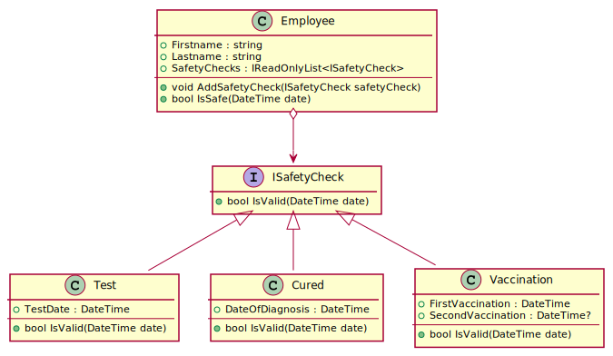

# Module

## Motivation

Wir haben im vorigen Beispiel 2 Klassen (*User* und *Person*) in einer Datei definiert. Wenn Projekte
größer werden, muss der Code natürlich auf mehrere Dateien aufgeteilt werden. Meist wird
JavaScript Code im Browser genutzt. Würden wir unsere Klassen aufteilen, müssen wir beide
Dateien einbinden:

```html
<!DOCTYPE html>
<html lang="en">
<head>
    <meta charset="UTF-8">
    <meta http-equiv="X-UA-Compatible" content="IE=edge">
    <meta name="viewport" content="width=device-width, initial-scale=1.0">
    <script src="user.js"></script>
    <script src="person.js"></script>
    <title>JS Test</title>
</head>
<body>
    <script>
        const post = new Post(new User("Max", "Mustermann", generateSchoolMail("mustermann")));
        console.log(post);
    </script>
</body>
</html>
```

Vertauschen wir die Dateien, entsteht ein Laufzeitfehler. In der Klasse Person wird nämlich schon
der User z. B. bei der Abfrage des Typs mit *instanceof* verwendet. In der Datei *person.js* gab
es vor den Modulen keine offizielle Technik, um eine andere JavaScript Datei einzubinden. Bei
größeren Projekten wird die Einbindung aller Dateien in der richtigen Reihenfolge natürlich immer
schwieriger.

Erschwerend kommt noch hinzu dass die gleiche Variable in mehreren Dateien deklariert werden
könnte. Dadurch entstehen Laufzeitfehler.

Mit ECMAScript 6 wurden sogenannte *Module* eingeführt. Module sind JavaScript Dateien, die
- Objekte von anderen Modulen mit *import* laden können und
- Objekte für andere Module mit *export* exportieren können.

Alle Objekte, die in einem Modul deklariert werden, sind *private*, d. h. nicht von außen
sichtbar. Das vermindert auch die Probleme von mehrfach deklarierten Variablen.

Damit Node.js eine Datei als Modul verwenden kann, braucht es entweder eine Konfiguration oder
die Dateiendung *mjs*. Nun können wir die Dateien aufteilen und das Programm mit *node index.mjs*
ausführen:

**user.mjs**
```javascript
"use strict";
function generateSchoolMail(lastname) {
    return lastname.substring(0, 3) + "@spengergasse.at";
}

class User {
    constructor(firstname, lastname, email) {
        this.firstname = firstname;
        this.lastname = lastname;
        this.email = email;
    }
    
    get id() { return this.email; }
}

export { User, generateSchoolMail };
```

**post.mjs**
```javascript
"use strict";
import { User } from "./user.mjs";

export default class Post {
    constructor(user, title) {
        this.user = user;
        this.title = title;
        this.ratings = [];
        this.comments = [];
    }

    addComment(user, comment) {
        // Important: operator precedence. Write !(a instanceof class)
        if (!(user instanceof User)) { throw new TypeError('user is not an instance of User.'); }
        if (typeof comment !== "string") { throw new TypeError('comment is not a string of User.'); }

        this.comments.push({ date: new Date(), user: user, comment: comment });
    }

    tryAddRating(user, rating) {
        if (!(user instanceof User)) { throw new TypeError('user is not an instance of User.'); }
        rating = Number(rating);
        if (!isFinite(rating)) { throw new TypeError('rating is not a number.'); }

        if (this.ratings.find(r => r.user.id == user.id)) { return false; }
        this.ratings.push({ user: user, rating: rating });
        return true;
    }

    get commentsCount() {
        return this.comments.length;
    }

    get averageRating() {
        if (!this.ratings.length) { return; }
        return this.ratings.reduce((prev, current) => prev + current.rating, 0) / this.ratings.length;
    }

    getCommentsFromUser(user) {
        if (!(user instanceof User)) { throw new TypeError('user is not an instance of User.'); }

        return this.comments.filter(c => c.user.id == user.id).length;
    }
}
```


**index.mjs**
```javascript
"use strict";
import Post from "./post.mjs"
import { User, generateSchoolMail } from "./user.mjs"

const post = new Post(new User("Max", "Mustermann", generateSchoolMail("mustermann")));
const commentator1 = new User("Sophie", "Musterfrau", "sophie@mail.at");
const commentator2 = new User("Tobias", "Eifrig", "tobias@mail.at");

post.addComment(commentator1, "First comment.");
post.addComment(commentator1, "Second comment.");
post.addComment(commentator2, "Third comment.");
post.tryAddRating(commentator1, 4);
post.tryAddRating(commentator1, 3);
post.tryAddRating(commentator2, 3);
console.log(`Number of comments: ${post.commentsCount}`);
console.log(`Average rating: ${post.averageRating}`);
console.log(`${commentator1.id} has written ${post.getCommentsFromUser(commentator1)} comments.`);
```

## Das export Statement

Es werden 2 Versionen des *export* Statements verwendet:
- *export default* und
- *export { obj1, obj2, ... }*

*export default* wird verwendet, um ein einzelnes Objekt gleich bei der Deklaration zu exportieren.
Diese Anweisung darf nur 1x vorkommen. Da die Klasse *Person* das einzige Objekt ist, das wir
aus *person.mjs* exportieren wollen, verwenden wir diese Methode.

Im Modul *user.mjs* wollen wir eine Klasse und eine Funktion exportieren. Daher verwenden wir die
zweite Form, um mehrere Objekte angeben zu können.

## Das import Statement

Der große Vorteil ist, dass wir im Modul *person.mjs* die Abhängigkeit zu *user.mjs* in Form eines
*import* Statements angeben können. In diesem Fall wird mittels `import { User } from "./user.mjs";`
die Deklaration von *User* importiert.

> **Wichtig:** Achte beim Import von selbst erstellen Dateien auf die Pfadangabe mit *./*. Sonst
> würden die installierten Pakete in *node_modules* durchsucht werden.

In der Datei *index.mjs* importieren wir die Personenklasse ohne `{}`, da sie mit *export default*
exportiert wurde. Vom Usermodul können brauchen wir beide Objekte. Wir können also die Deklaration
von *User* in verschiedenen Dateien (*person.mjs* und *index.mjs*) nutzen, ohne dass es zu
Konflikten kommt.

## Übung

In der klassischen objektorientierten Programmierung würde ein kleines Programm, welches den
3G Nachweis von MitarbeiterInnen verwalten kann, so modelliert werden:


<sup>
https://www.plantuml.com/plantuml/uml/dO_TIiD048NlzodcigNi2uZKIgjGA1HiwVsuEsa7zoTaDa9Gtzsa9RgffQXxDSoUETyvCqbOfTexTM1BGBvC3HHCpefI719L1Hg2vGOBIityGEO5tXIqR_8SeuEbxD2n7IqmqPOzWMs7iVfGoZWKWIr9wW-wkTF13VJouuVM-ZUEHojTb_fzEiZJe-PrHRPdTTVhOi6u3r5O_eayMLvXxj0O3fWuXfxyo9MaV7-6dcp8n60lA-x-aYwtk9BnmPSkDaI3W04zjLn95OVzQR_2Y-lCKTglvHEXNGVNh5ZIRSwR3hE_HhPmRssc6ELoaEzvFAZRYNws_QeHjJuhEgDWQ-y-0G00
</sup>

Entwickle nun eine JavaScript Lösung für dieses Modell. Dabei müssen natürlich Besonderheiten der
Sprache JavaScript berücksichtigt werden:
- Um eine read-only Collection zu simulieren, kannst du ein get Property für *safetyChecks* definieren.
  Es liefert mit `function() { return myArray.values(); };` die Elemente als sogenannter *iterator*.
- Achte auf die naming conventions der Properties (Kleinschreibung in JavaScript).
- Es gibt keine Interfaces in JavaScript. Verwende daher normale Klassen, die dann mit *extends*
  erweitert werden (siehe https://developer.mozilla.org/en-US/docs/Web/JavaScript/Reference/Classes).
  Auch die Antwort von https://stackoverflow.com/questions/29480569/does-ecmascript-6-have-a-convention-for-abstract-classes/30560792
  ist hilfreich wenn es darum geht, eine abstrakte Klasse oder ein Interface zu simulieren.
- Die Methode *isValid()* im (simulierten) Interface kann in Javascript einfach *undefined* zurückgeben.
  Das passiert bei der Deklaration der Funktion ohne Inhalt automatisch.
- Prüfe bei *addSafetyCheck*, ob auch ein safety check als Argument übergeben wurde.
- Deklariere jede Klasse in einem Modul und exportiere die Klasse.
- Erstelle eine Datei *index.mjs* und teste die Implementierung mit geeigneten Aufrufen.

Die Businesslogik ist einfach:
- Ein Test ist 48h gültig.
- Bei Cured (Genesung) liegt die Gültigkeit bei 180 Tagen.
- Eine Impfung ist bis 270 Tage nach der Zweitimpfung gültig. Achte mit einem set Property darauf,
  dass *secondVaccination* nicht überschrieben werden kann wenn es einen Wert besitzt. Außerdem
  darf es erst gesetzt werden, wenn *firstVaccination* einen Datumswert besitzt. Ansonsten ist
  der Wert einfach nicht zu setzen. Auf https://developer.mozilla.org/en-US/docs/Web/JavaScript/Reference/Functions/set
  gibt es Informationen über setter.

