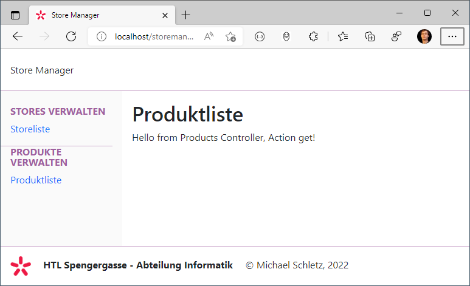

# JavaScript im Browser

Damit wir Techniken wie Promises und Verarbeitung von Formularen im Browser testen können,
verwenden wir das Musterprojekt in [storemanager](storemanager). Es ist eine kleine PHP
Applikation, die aber die Basis einer Architektur ist (MVC), die sehr viel kann.




```
│   index.php                             Startpunkt. Liest die GET Parameter.
│   layout.php                            Definiert das gmeinsame Layout.
│   notFound.php                          Wird aufgerufen, wenn die View nicht gefunden wurde.
│   
├───controllers
│       controller.class.php              Basisklasse für alle Controller.
│       homeController.class.php          Wird bei URLS mit dem Parameter controller=Home oder als Defaultwert aufgerufen.
│       productsController.class.php      Wird bei URLS mit dem Parameter controller=Products oder als Defaultwert aufgerufen.
│       storesController.class.php        Wird bei URLS mit dem Parameter controller=Stores oder als Defaultwert aufgerufen.
│       
├───css
│       site.css                          Das gemeinsame CSS. Wird in layout.php immer geladen.
│       
├───img
│       favicon.ico
│       schullogo.png
│       schullogoMitText.png
│       
├───js
│       site.js                           Javascript. Wird im Layout am Ende eingebunden.
│       
├───lib
│   ├───bootstrap5
│   │       
│   ├───fontawesome5
│   │       
│   ├───vuejs3
│   │       
│   └───webfonts
│           
└───views
        home.php                          Wird zurückgegeben, wenn der Controller home aufgerufen wird.
        products.php                      Wird zurückgegeben, wenn der Controller products aufgerufen wird. 
        stores.php                        Wird zurückgegeben, wenn der Controller stores aufgerufen wird.
        stores.php.css                    Wird im head eingebunden, wenn der Controller stores aufgerufen wird.
        

```