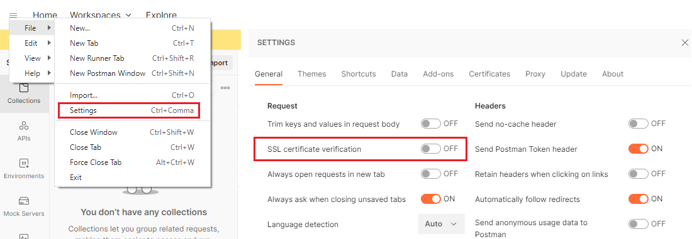
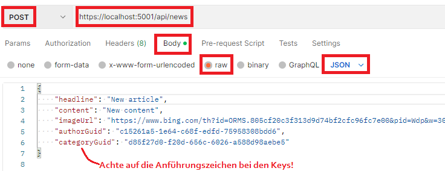
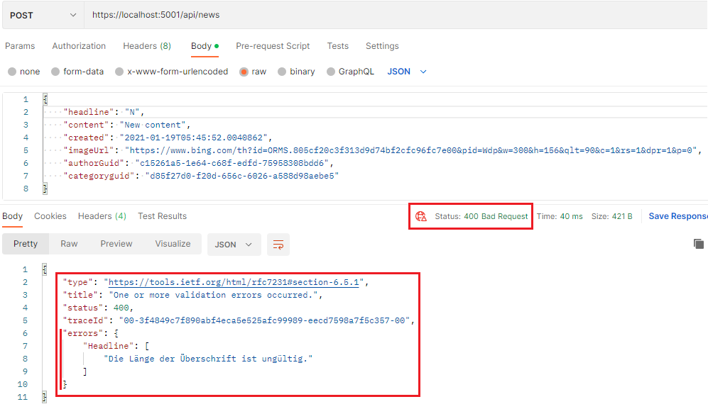

# CRUD Operationen und serverseitige Validierung

Bis jetzt haben wir in unserem Controller Daten gelesen. Natürlich wollen wir auch in einer
Webapplikation Daten bearbeiten. Dafür gibt es unterschiedliche *HTTP request types*:

| HTTP request type | Action                    |
| ----------------- | ------------------------- |
| GET               | READ from the database    |
| POST              | INSERT a new record       |
| PUT               | UPDATE an existing record |
| DELETE            | DELETE an existing record |

Unser Controller muss also auch auf POST, PUT und DELETE requests reagieren. Dafür ist aber
etwas Vorarbeit erforderlich.

## Hinzufügen von Automapper

Füge in der *csproj* Datei *des Application Projektes* eine Referenz auf Automapper im Element
*ItemGroup* zu den anderen *PackageReference* Elementen hinzu:

```xml
	<ItemGroup>
		<!-- Other PackageReferences -->
		<PackageReference Include="AutoMapper.Extensions.Microsoft.DependencyInjection" Version="12.*" />		
	</ItemGroup>
```

Lege danach im *Application Projekt* einen Ordner Dto an und erstelle eine leere Klasse *MappingProfile*
mit einem Konstruktor:

```
📁 YourProject.Application
    └── 📁 Dto
            └── MappingProfile.cs
```

**MappingProfile.cs**
```c#
public class MappingProfile : Profile  // using AutoMapper;
{
    public MappingProfile()
    {
        
    }
}
```

Nun musst du in ASP.NET Core in der Datei *Program.cs* Automapper registrieren. Dafür wird
*AddAutoMapper()* verwendet. Schreibe diese Anweisung im Bereich des Builders, also vor 
*builder.Build()*. Die *typeof* Anweisung ist nötig, damit das Service weiß, in welchen Projekt
sich die zu mappenden Klassen befinden.

**Program.cs**
```c#
// var builder = WebApplication.CreateBuilder(args);
// Other services
builder.Services.AddAutoMapper(typeof(MappingProfile));
// ...
// var app = builder.Build();

```

Das Programm sollte nun mit installiertem AutoMapper kompilierbar sein. Den Grund für den Einsatz
von Automapper sehen wir im nächsten Punkt.

## DTO (data transfer object) Klassen: Wozu sind sie gut?

In unserem Musterprojekt gibt es z. B. eine Modelklasse *Article*, die einen Newsartikel speichert.
Sie sieht so aus (verkürzt):

```c#
public class Article
{
    public Article(
        string headline, string content, DateTime created,
        string imageUrl, Author author, Category category)
    {
        // Initialization
    }

    [Key]
    [DatabaseGenerated(DatabaseGeneratedOption.Identity)]
    public int Id { get; private set; }
    public Guid Guid { get; set; }
    [MaxLength(255)]
    public string Headline { get; set; }
    [MaxLength(65535)]
    public string Content { get; set; }
    public DateTime Created { get; set; }
    [MaxLength(255)]
    public string ImageUrl { get; set; }
    public Author Author { get; set; }
    public Category Category { get; set; }
}
```

Damit wir einen neuen Artikel erstellen können, muss uns der Client Informationen dazu schicken.
Betrachten wir die Modelklasse, haben wir aber einige Probleme:

- Die interne Id wird von der Datenbank generiert. Sie darf gar nicht vom Client kommen (suche
  nach *overposting* im Web).
- Soll uns der Client wirklich das *Created* Datum schicken? Es kann manipuliert sein. Das Datum
  wird erst im Backend zugewiesen.
- Die Properties *Author* und *Category* sind vollständige Entities. Soll uns der Client also
  einen vollständigen *Author* und *Category* Datensatz mitschicken?

Um ein tieferes Verständnis zu bekommen, müssen wir uns mit dem Begriff *Modelbinding* in ASP.NET Core
befassen. Ein POST Request aus einer single page app liefert uns die Daten einfach als JSON
im request body: 

```json
{
    "headline": "New article",
    "content": "New content",
    "imageUrl": "https://www.bing.com/th?id=ORMS.805cf20c3f313d9d74bf2cfc96fc7e00&pid=Wdp&w=300&h=156&qlt=90&c=1&rs=1&dpr=1&p=0",
    "authorGuid": "c15261a5-1e64-c68f-edfd-75958308bdd6",
    "categoryGuid": "d85f27d0-f20d-656c-6026-a588d98aebe5"
}
```

Wenn der Request im Backend ankommt, ist dies zuerst einmal ein JSON String.

> Modelbinding bedeutet, dass ASP.NET Core versucht, aus den JSON Daten eine Instanz einer Klasse
> zu erstellen. Dabei werden Annotations zur Validierung bearbeitet und wir können im Controller
> bequem mit einer Instanz arbeiten. Der Modelbinder ist nicht case-sensitive, sodass die
> übliche Kleinschreibung ohne Probleme verwendet werden kann.

Wenn wir uns das JSON ansehen, werden wir feststellen, dass ASP gar keine Instanz von *Article*
erstellen kann:
- Im Konstruktor angeforderte Daten wie created, author und category kommen nicht im JSON vor.
  ASP verwendet den Konstruktor, um das Objekt zu erzeugen. Das kann nur fehlschlagen.
- Statt dem Autor und der Kategorie werden GUIDs gesendet, die wir zuerst mit einer Datenbankabfrage
  auflösen müssen.
- Erst dann können wir einen neuen Artikel mit *new* erstellen.

Nun kommen die DTO Klassen ins Spiel.

> Eine DTO Klasse bildet die ankommenden JSON Daten in Form einer C# Klasse ab.

### Wie und wo werden DTO Klassen definiert?

Im *Application* Projekt haben wir bereits einen Ordner *Dto* erstellt. Nun legen wir eine
Klasse *ArticleDto* an.

```
📁 YourProject.Application
    └── 📁 Dto
            ├── ArticleDto.cs
            └── MappingProfile.cs
```

**ArticleDto.cs**

```c#
public record ArticleDto(
    Guid Guid,

    [StringLength(255, MinimumLength = 3, ErrorMessage = "Die Länge der Überschrift ist ungültig.")]
    string Headline,

    [StringLength(65535, MinimumLength = 3, ErrorMessage = "Die Länge des Contents ist ungültig.")]
    string Content,

    [Url(ErrorMessage = "Ungültige URL.")]
    [StringLength(65535, MinimumLength = 3, ErrorMessage = "Die Länge der URL ist ungültig.")]
    string ImageUrl,

    Guid AuthorGuid,
    Guid CategoryGuid) : IValidatableObject
{
    public IEnumerable<ValidationResult> Validate(ValidationContext validationContext)
    {
        // We have registered SpengernewsContext in Program.cs in ASP.NET core. So we can
        // get this service to access the database for further validation.
        var db = validationContext.GetRequiredService<SpengernewsContext>();
        if (!db.Authors.Any(a => a.Guid == AuthorGuid))
        {
            yield return new ValidationResult("Author does not exist", new[] { nameof(AuthorGuid) });
        }
        if (!db.Categories.Any(c => c.Guid == CategoryGuid))
        {
            yield return new ValidationResult("Category does not exist", new[] { nameof(CategoryGuid) });
        }
    }
}
```

Dabei fallen uns gleich mehrere Dinge auf:

#### Positional records

Mit C# 9 wurden records eingeführt. Sie sind *immutable objects*, alle Properties haben also nur
*getter*, aber keine *setter*. Ein *positional record* wird quasi als Konstruktor definiert.
Die entsprechenden Properties werden dann automatisch angelegt und zugewiesen. Deswegen
schreiben wir die Argumente auch groß (und nicht klein wie normale Argumente einer Methode).

#### Validation Annotations

ASP.NET bietet die Möglichkeit, nach dem *ModelBilding* die Klasse automatisch zu *validieren*.
Validieren bedeutet, dass eine Klasse erstellt werden konnte (die Datentypen stimmen also),
es sollen aber noch weitere Prüfungen durchgeführt werden. ASP bietet sehr viele eingebaute Annotations
zur Validierung an: <sup>https://learn.microsoft.com/en-us/aspnet/core/mvc/models/validation?view=aspnetcore-6.0#built-in-attributes</sup>


> [StringLength]: Validates that a string property value doesn't exceed a specified length limit.  
> [Range]: Validates that the property value falls within a specified range.  
> [EmailAddress]: Validates that the property has an email format.  
> [ValidateNever]: Indicates that a property or parameter should be excluded from validation.  
> [CreditCard]: Validates that the property has a credit card format.
> [Compare]: Validates that two properties in a model match.  
> [Phone]: Validates that the property has a telephone number format.  
> [RegularExpression]: Validates that the property value matches a specified regular expression.  
> [Required]: Validates that the field isn't null. See [Required] attribute for details about this attribute's behavior.  
> [Url]: Validates that the property has a URL format.
> [Remote]: Validates input on the client by calling an action method on the server. See > [Remote] attribute for details about this attribute's behavior.  

Diese Attribute können durch Parameter noch weiter definiert werden. So kann mit
`[StringLength(255, MinimumLength = 3, ErrorMessage = "Die Länge des Artikels ist ungültig.")]`
eine minimale und maximale Länge und eine Fehlermeldung definiert werden. Beachte bei *Required*,
dass wir sowieso mit dem *nullable* Feature arbeiten. Daher muss es nicht extra geschrieben werden,
wenn der Typ nicht *nullable* ist (also kein ? hat).

#### Das Interface *IValidatableObject*

Manchmal möchte man Überprüfungen machen, die mehr Logik erfordern. Wir können dafür das Interface
*IValidatableObject* implementieren. Es besteht aus einer *Validate()* Methode, die eine Liste
von Fehlern (*ValidationResult*) zurückgibt. Durch den *ValidationContext* können wir Services, die
wir in ASP.NET registriert haben, abrufen. Das ermöglicht auch einen Zugriff auf die Datenbank.

> Die Validierung muss schnell ablaufen, da sie bei jedem Request ausgeführt wird. Überlege daher
> genau, wenn externe Ressourcen dafür verwendet werden. Das Prüfen eines Fremdschlüssels sollte
> der einzige Fall bleiben, wo eine externe Ressource verwendet wird.

### AutoMapper und DTO Klassen

Ergänze nun die Klasse *MappingProfile.cs* im *Application Projekt*:

```c#
public class MappingProfile : Profile
{
    public MappingProfile()
    {
        CreateMap<ArticleDto, Article>();  // ArticleDto --> Article
        CreateMap<Article, ArticleDto>();  // Article --> ArticleDto
    }
}
```

Automapper ist ein recht komplexes Paket. Der erste Zugang ist aber einmal recht simpel:

> Automapper instanziert Objekte eines Typs mit Hilfe von Objekten eines anderen Typs. 
> Dabei weist er Properties, die gleich heißen, 1:1 zu. Achte daher auf den Namen der Properties.

Wenn wir unsere Klasse *ArticleDto* betrachten, haben wir die selben Namen wie in *Article* gewählt.

**ArticleDto**
```c#
public record ArticleDto(Guid Guid, string Headline, string Content, string ImageUrl, Guid AuthorGuid, Guid CategoryGuid)
```

**Article**
```c#
public class Article
{
    public int Id { get; private set; }
    public Guid Guid { get; set; }
    public string Headline { get; set; }
    public string Content { get; set; }
    public DateTime Created { get; set; }
    public string ImageUrl { get; set; }
    public Author Author { get; set; }
    public Category Category { get; set; }
}
```

Manche Felder kommen in *Article* nicht vor. Sie werden daher uninitialisiert gelassen. Die Felder
*Guid, Headline, Content, ImageUrl* kommen in beiden Klassen vor. Daher wird AutoMapper diese
Felder befüllen. Für das Befüllen der anderen Felder sind wir dann im Controller zuständig.

## Der Controller

Im *Webapi* Projekt liegen im Ordner *Controllers* die einzelnen Controller.

```
📁 YourProject.Webapi
    └── 📁 Controllers
            └── NewsController.cs
```

Der *NewsController*, der das Einfügen, Bearbeiten und Löschen von Artikeln zulässt, sieht nun so
aus. Beachte die Hinweise als Codekommentar in den Methoden *AddArticle*, *EditArticle* und *DeleteArticle*:

```c#
[ApiController]
[Route("/api/[controller]")]
public class NewsController : ControllerBase
{

    private readonly IMapper _mapper;
    private readonly SpengernewsContext _db;

    public NewsController(SpengernewsContext db, IMapper mapper)
    {
        _db = db;
        _mapper = mapper;
    }

    /// <summary>
    /// GET Request /api/news/
    /// Returns a list of all articles with base information.
    /// </summary>
    [HttpGet]
    public IActionResult GetAllNews()
    {
        // Project your entities to a custon JSON WITHOUT INTERNAL KEYS, ...
        var news = _db.Articles.OrderBy(a => a.Created)
            .Select(a => new
            {
                a.Guid,
                a.Headline,
                a.Content,
                a.Created,
                a.ImageUrl,
                AuthorGuid = a.Author.Guid,
                AuthorFirstname = a.Author.Firstname,
                AuthorLastname = a.Author.Lastname,
                CategoryGuid = a.Category.Guid,
                CategoryName = a.Category.Name
            })
            .ToList();
        return Ok(news);
    }

    /// <summary>
    /// GET Request /api/news/{id}
    /// </summary>
    [HttpGet("{guid:Guid}")]
    public IActionResult GetNewsDetail(Guid guid)
    {
        // Project your entities to a custon JSON WITHOUT INTERNAL KEYS, ...
        var article = _db.Articles
            .Where(a => a.Guid == guid)
            .Select(a => new
            {
                a.Guid,
                a.Headline,
                a.Content,
                a.Created,
                a.ImageUrl,
                AuthorGuid = a.Author.Guid,
                AuthorFirstname = a.Author.Firstname,
                AuthorLastname = a.Author.Lastname,
                CategoryGuid = a.Category.Guid,
                CategoryName = a.Category.Name
            })
            .FirstOrDefault(a => a.Guid == guid);
        if (article is null) { return NotFound(); }
        return Ok(article);
    }

    /// <summary>
    /// POST Request /api/news with JSON body
    /// Creates a new article in the database. Validation of the dto class is performed
    /// automatically by ASP.NET Core, so you have to implement this in your dto class!
    /// </summary>
    [HttpPost]
    public IActionResult AddArticle(ArticleDto articleDto)
    {
        // After mapping we have to resolve the foreign key guids.
        // First() throws an exception if no data matches the predicate. So you have to check
        // the referenced data in your Validate method of your dto class!
        var article = _mapper.Map<Article>(articleDto,
            opt => opt.AfterMap((dto, entity) =>
            {
                entity.Author = _db.Authors.First(a => a.Guid == articleDto.AuthorGuid);
                entity.Category = _db.Categories.First(c => c.Guid == articleDto.CategoryGuid);
                entity.Created = DateTime.UtcNow;
            }));
        _db.Articles.Add(article);
        try { _db.SaveChanges(); }
        catch (DbUpdateException) { return BadRequest(); } // DB constraint violations, ...
        return Ok(_mapper.Map<Article, ArticleDto>(article));
    }

    /// <summary>
    /// PUT Request /api/news/(guid) with JSON body
    /// Updates an article in the database. Validation of the dto class is performed
    /// automatically by ASP.NET Core, so you have to implement this in your dto class!
    /// </summary>
    [HttpPut("{guid:Guid}")]
    public IActionResult EditArticle(Guid guid, ArticleDto articleDto)
    {
        if (guid != articleDto.Guid) { return BadRequest(); }
        var article = _db.Articles.FirstOrDefault(a => a.Guid == guid);
        if (article is null) { return NotFound(); }
        // Overwrite infos in article with new data in articleDto. Don't forget to resolve
        // the foreign key guids!
        _mapper.Map(articleDto, article,
            opt => opt.AfterMap((dto, entity) =>
            {
                entity.Author = _db.Authors.First(a => a.Guid == articleDto.AuthorGuid);
                entity.Category = _db.Categories.First(c => c.Guid == articleDto.CategoryGuid);
            }));

        try { _db.SaveChanges(); }
        catch (DbUpdateException) { return BadRequest(); } // DB constraint violations, ...
        return NoContent();
    }

    /// <summary>
    /// DELETE Request /api/news/(guid) with JSON body
    /// Updates an article in the database.
    /// </summary>
    [HttpDelete("{guid:Guid}")]
    public IActionResult DeleteArticle(Guid guid)
    {
        // Try to find article in the database.
        var article = _db.Articles.FirstOrDefault(a => a.Guid == guid);
        // Article does not exist: return 404.
        if (article is null) { return NotFound(); }
        // TODO: Remove referenced data (if needed)
        // Remove article.
        _db.Articles.Remove(article);
        try { _db.SaveChanges(); }
        catch (DbUpdateException) { return BadRequest(); } // DB constraint violations, ...
        return NoContent();
    }
}
```

## Testen mit Postman

Um die API auch testen zu können, brauchen wir das Programm *Postman* (oder ein vergleichbares
Programm). Deaktiviere dafür zuerst die Zertifikatsprüfung, da wir mit selbst generierten
Zertifikaten arbeiten:



Mit Postman können wir alle Requestarten (GET, POST, PUT, DELETE) senden. Manche Requests
brauchen einen *request body*. Dort kommen die Daten hinein, die der Modelbinder von ASP
auslesen soll. Achte auf den Typ *raw* und *JSON*:



Am Besten lege zuerst ein Tab mit dem GET Request an, damit du gültige Werte für die Fremdschlüssel
erhältst.

### Validierungsfehler

Treten bei der Validierung Fehler auf, wird automatisch von ASP.NET eine Antwort vom Typ
*400 Bad Request* gesendet. Das Properties *errors* beinhaltet dabei das genaue Property, wo
der Fehler aufgetreten ist. Der Client kann so die betreffenden Formularfelder markieren und
den Fehler für den User ausgeben.


