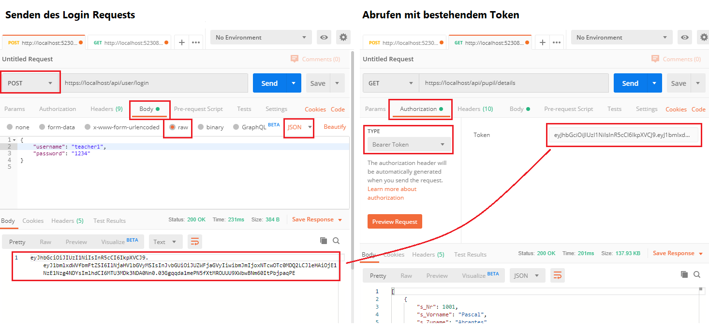

# JWT Authentication in ASP.NET Core

> Für dieses Kapitel musst du vorher die Inhalte von
> [Authentication und Authorization](AuthenticationPrinciples/README.md) durchgearbeitet haben.

## Erzeugen eines Secrets für die JWT Generierung

Da der Hash unseres JWT mit einem Secret berechnet wird (HMAC Verfahren), müssen wir zuerst
eine base64 codierte Zufallszahl in die Datei *appsettings.json* legen. Dafür kannst du z. B.
[einen online Generator](https://generate.plus/en/base64) verwenden und einen 128 Bytes langen
Wert generieren lassen.

Erstelle danach in der Datei *appsettings.json* einen Key *Secret* und füge den Wert ein:

```javascript
{
  "ConnectionStrings": {
    // Your connection strings
  },
  "Secret": "4UO5FmFW6wqj6PtWTXWRRiCvfdKq2dx+gsCM6d+eWR6++LrfKCP6jRvpMkw95KbYr9u1/VS1/fPWRg/XBmYjeQrR6knknq3w0TaDNOaU2QC8qP/CpTgdB5u3aHdIfpI1Tzn/5dx2fWYp0JCqYNhxzMDLGRifddA7JKUlhxVrx3E=",
  "Logging": {
    "LogLevel": {
      "Default": "Information",
      "Microsoft.AspNetCore": "Warning",
      "Microsoft.EntityFrameworkCore.Database.Command": "Warning"
    }
  },
  "AllowedHosts": "*"
}
```

## Aktivieren der Authentication und Authorization in ASP.NET Core

Füge zuerst in der *csproj* Datei des *Webapi Projektes* das Paket
*Microsoft.AspNetCore.Authentication.JwtBearer* hinzu:

```xml
<ItemGroup>
    <!-- other packages -->
    <PackageReference Include="Microsoft.AspNetCore.Authentication.JwtBearer" Version="6.*" />
    <!-- other packages -->
</ItemGroup>
```

Danach editiere die Datei *Program.cs* im *Webapi* Projekt. Füge im Builder Bereich (also vor
*builder.Build()*) die folgenden Zeilen ein:

```c#
// JWT Authentication ******************************************************************************
// using Microsoft.AspNetCore.Authentication.JwtBearer;
// using Microsoft.IdentityModel.Tokens;

byte[] secret = Convert.FromBase64String(builder.Configuration["Secret"]);
builder.Services
    .AddAuthentication(options => options.DefaultScheme = JwtBearerDefaults.AuthenticationScheme)
    .AddJwtBearer(options =>
    {
        options.TokenValidationParameters = new TokenValidationParameters
        {
            ValidateIssuerSigningKey = true,
            IssuerSigningKey = new SymmetricSecurityKey(secret)
        };
    });
// *************************************************************************************************
```

Dieser Code liest das Secret aus der Datei *appsettings.json* und wandelt es wieder in ein Bytearray
um. Danach wird die Authentication so konfiguriert, dass das Standardverfahren JWT ist. Der
Key wird ebenfalls übergeben, sodass ASP.NET Core von selbst einen manipulierten Token erkennen kann.


## Anpassen des Models: Userdaten speichern

Wir verwenden gleich unsere Modelklasse *Author*. Damit sich ein Autor anmelden kann, fügen
wir 3 Felder hinzu: *Username*, *Salt* und *PasswordHash*. With ein Autor im Konstruktor erstellt,
können wir mit Hilfe des Initialpasswortes ein Salt generieren und den Hashwert des übergebenen
Passwortes setzen.

Das *Salt* ist eine 128 bit (16 Byte) lange Zufallszahl. *Verwechsle dies nicht mit dem
Secret, mit dem unser Token signiert wird!* Dafür wird die Methode *GenerateRandomSalt()* ergänzt,
die diese Zufallszahl generiert. **Wird der gespeicherte Wert für Salt verändert, wird das
Passwort ungültig. Der User kann sich also nicht mehr anmelden.**

*CalculateHash()* berechnet mit Hilfe des Salts den Hashwert des Passwortes. Dabei wird das
gespeicherte Salt verwendet. Die Methode *CheckPassword()* ist sehr einfach: Sie berechnet den
Hashwert **des übergebenen Passwortes** und prüft, ob er gleich dem gespeicherten Hashwert ist.
Somit brauchen wir kein Passwort im Klartext zu speichern!

Konkret sehen diese Methoden in der Modelklasse so aus:

```c#
[Index(nameof(Email), IsUnique = true)]
[Index(nameof(Username), IsUnique = true)]
public class Author
{
    public Author(string firstname, string lastname, string email,
        string username, string initialPassword, string? phone = null)
    {
        // Other initializations
        Username = username;
        SetPassword(initialPassword);
    }
    // Other properties (Id, ...)
    public string Username { get; set; }
    public string Salt { get; set; }
    public string PasswordHash { get; set; }

    // Hint for the compiler that we initialize some properties in this method.
    [MemberNotNull(nameof(Salt), nameof(PasswordHash))]  
    public void SetPassword(string password)
    {
        Salt = GenerateRandomSalt();
        PasswordHash = CalculateHash(password, Salt);
    }
    public bool CheckPassword(string password) => PasswordHash == CalculateHash(password, Salt);
    /// <summary>
    /// Generates a random number with the given length of bits.
    /// </summary>
    /// <param name="length">Default: 128 bits (16 Bytes)</param>
    /// <returns>A base64 encoded string from the byte array.</returns>
    private string GenerateRandomSalt(int length = 128)
    {
        byte[] salt = new byte[length / 8];
        using (System.Security.Cryptography.RandomNumberGenerator rnd =
            System.Security.Cryptography.RandomNumberGenerator.Create())
        {
            rnd.GetBytes(salt);
        }
        return Convert.ToBase64String(salt);
    }

    /// <summary>
    /// Calculates a HMACSHA256 hash value with a given salt.
    /// <returns>Base64 encoded hash.</returns>
    private string CalculateHash(string password, string salt)
    {
        byte[] saltBytes = Convert.FromBase64String(salt);
        byte[] passwordBytes = System.Text.Encoding.UTF8.GetBytes(password);

        System.Security.Cryptography.HMACSHA256 myHash =
            new System.Security.Cryptography.HMACSHA256(saltBytes);

        byte[] hashedData = myHash.ComputeHash(passwordBytes);

        // Das Bytearray wird als Hexstring zurückgegeben.
        return Convert.ToBase64String(hashedData);
    }
}
```

### Seeden: Erstellen der Initialpasswörter

Damit wir gültige und bekannte Userdaten erzeugen, verwenden wir für jeden Autor einfach
das Passwort *1111* als Initialpasswort. Der Konstruktor von *Author* erstellt dann ein
neues Salt und weist den Hashwert von *1111* zu.

```c#
public void Seed()
{
    // ...
    var authors = new Faker<Author>("de").CustomInstantiator(f =>
    {
        return new Author(
            // other properties
            username: lastname.ToLower(),
            initialPassword: "1111",
            // other properties
        )
        { Guid = f.Random.Guid() };
    })
    .Generate(10)
    .GroupBy(a => a.Email).Select(g => g.First())
    .ToList();
    Authors.AddRange(authors);
    SaveChanges();
    // ...
}
```

## Erstellen eines User Controllers

Nun wird eine Klasse *UserController* im Ordner *Controllers* erstellt, damit der Client
Username und Passwort überprüfen kann.
Der Server antwortet - wenn die Daten passen - mit dem Token. Über *depenency injection*
holen wir uns die Datenbank und das *IConfiguration* Interface. Letzteres bietet ASP.NET Core
automatisch an und dadurch haben wir die Möglichkeit, im Controller auf Inhalte der Datei
*appsettings.json* zuzugreifen.

```c#
[Route("api/[controller]")]
[ApiController]
[AllowAnonymous]
public class UserController : ControllerBase
{
    // DTO class for the JSON body of the login request
    public record CredentialsDto(string username, string password);

    private readonly SpengernewsContext _db;
    private readonly IConfiguration _config;  // Needed to read the secret from appsettings.json
    public UserController(SpengernewsContext db, IConfiguration config)
    {
        _db = db;
        _config = config;
    }

    /// <summary>
    /// POST /api/user/login
    /// </summary>
    [HttpPost("login")]
    public IActionResult Login([FromBody] CredentialsDto credentials)
    {
        // Read the secret from appsettings.json via IConfiguration
        // This is NOT the salt of the user password! It is the key to sign the JWT, so
        // the client cannot manupulate our token.
        var secret = Convert.FromBase64String(_config["Secret"]);
        var lifetime = TimeSpan.FromHours(3);
        // User exists in our database and the calculated hash matches
        // the password hash in the database?
        var user = _db.Authors.FirstOrDefault(a => a.Username == credentials.username);
        if (user is null) { return Unauthorized(); }
        if (!user.CheckPassword(credentials.password)) { return Unauthorized(); }

        string role = "Admin";  // TODO: Set your role based on your rules.
        var tokenHandler = new JwtSecurityTokenHandler();
        var tokenDescriptor = new SecurityTokenDescriptor
        {
            // Payload for our JWT.
            Subject = new ClaimsIdentity(new Claim[]
            {
                // Write username to the claim (the "data zone" of the JWT).
                new Claim(ClaimTypes.Name, user.Username.ToString()),
                // Write the role to the claim (optional)
                new Claim(ClaimsIdentity.DefaultRoleClaimType, role)
            }),
            Expires = DateTime.UtcNow + lifetime,
            SigningCredentials = new SigningCredentials(
                new SymmetricSecurityKey(secret),
                SecurityAlgorithms.HmacSha256Signature)
        };
        var token = tokenHandler.CreateToken(tokenDescriptor);
        // Return the token so the client can save this to send a bearer token in the
        // subsequent requests.
        return Ok(new
        {
            user.Username,
            Role = role,
            Token = tokenHandler.WriteToken(token)
        });
    }

    /// <summary>
    /// GET /api/user/me
    /// Gets information about the current (authenticated) user.
    /// </summary>
    [Authorize]
    [HttpGet("me")]
    public IActionResult GetUserdata()
    {
        // No username is set in HttpContext? Should never occur because we added the
        // Authorize annotation. But the properties are nullable, so we have to check.
        var username = HttpContext?.User.Identity?.Name;
        if (username is null) { return Unauthorized(); }

        // Valid token, but no user match in the database (maybe deleted by an admin).
        var user = _db.Authors.FirstOrDefault(a => a.Username == username);
        if (user is null) { return Unauthorized(); }
        return Ok(new
        {
            user.Firstname,
            user.Lastname,
            user.Email,
            user.Phone
        });
    }

    /// <summary>
    /// GET /api/user/all
    /// List all users.
    /// Only for users which has the role admin in the claim of the JWT.
    /// </summary>
    [Authorize(Roles = "Admin")]
    [HttpGet("all")]
    public IActionResult GetAllUsers()
    {
        var user = _db.Authors
            .Select(a => new
            {
                a.Firstname,
                a.Lastname,
                a.Email,
                a.Phone
            })
            .ToList();
        if (user is null) { return BadRequest(); }
        return Ok(user);
    }
}
```

### Absichern von Controllern: Authorize Annotation

Im Usercontroller sind dir vielleicht schon folgende Annotations aufgefallen:

- **\[AllowAnonymous\]** Erlaubt den anonymen Zugriff, d. h. im Request wurde kein
  Token übermittelt. Kann auf Controller und auf Methodenebene verwendet werden.
  Standardwert; wird verwendet, wenn der Controller abgesichert ist, aber einige Methoden
  sollen ohne Login abgerufen werden können.
- **\[Authorize\]** Erlaubt nur den Zugriff, wenn ein gültiger Token übermittelt wurde.
  Falls nicht, sendet ASP.NET Core automatisch *Not authenticated* an den Client.
  Kann auf Controller und auf Methodenebene verwendet werden.
- **\[Authorize(Roles = "Admin")\]** Erlaubt nur den Zugriff, wenn ein gültiger Token
  der im Claim des Type *ClaimsIdentity.DefaultRoleClaimType* die angegebene Rolle
  hat. Falls nicht, sendet ASP.NET Core automatisch *Not authenticated* oder *Not authorized*
  an den Client. Kann auf Controller und auf Methodenebene verwendet werden.

Mit diesen Annotations kannst du deine Controller absichern. Wenn du einmal den Namen des
angemeldeten Users brauchst, kannst du wie in der Methode *GetUserdata()* gezeigt den *HttpContext*
verwenden.

> In der Standardeinstellung sind Controller ohne Annotation nicht abgesichert. Füge daher
> die passenden *Authorize* Annotations hinzu!

## Testen in Postman

Um die Authentication zu testen, kannst du einen POST Request an die Route */api/user/login* senden.
Wenn du gültige Daten schickst, sendet der Server einen Token zurück. Diesen Token musst du kopieren
und bei anderen Requests (z. B. */api/user/me*) als *bearer token* senden.

