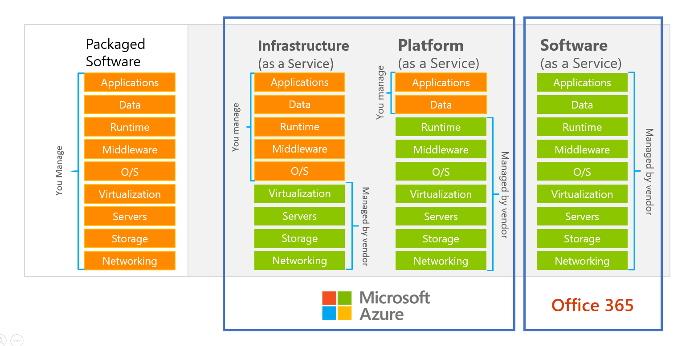
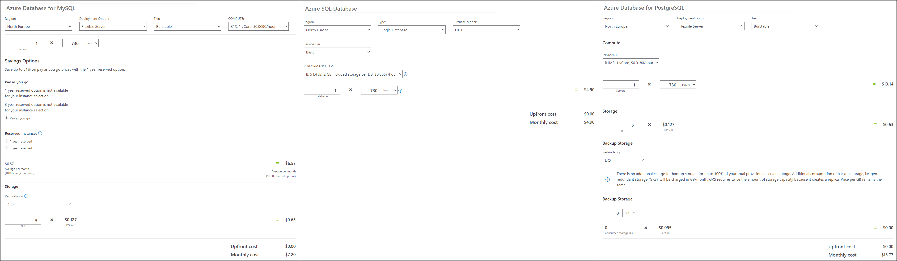

# Deployment des Containers in Azure

1. Erstelle wie in [Vorbereitung für das Deployment](08_Deployment_Docker.md) beschrieben
   ein Dockerfile für deine Applikation.
2. Hole dir das Education Guthaben, indem du dich auf https://portal.azure.com mit deinem Schul-Account
   anmeldest und nach *Education* in der Suchbox oben suchst.
3. Lade die Azure CLI Tools für deine Plattform von https://learn.microsoft.com/en-us/cli/azure/install-azure-cli
4. Gib in der Konsole `az login` ein. Es öffnet sich ein Browserfenster für die Authentifizierung.

> **Hinweis:** Die nachfolgenden Anweisungen und Erklärungen beschreiben das Azure Command Line Tool *az*.
> In der Datei [deploy_app.sh](deploy_app.sh) ist ein fertiges Skript, das diese Befehle bündelt.
> Du musst das Skript nur in dein Repository kopieren und anpassen. Führe es dann mit der **git bash** aus.

## Services in der Azure Cloud, IaaS, PaaS

An unserer Schule wurden früher alle Service am Standort (*on-premises*) betrieben. Das hat
allerdings viele Nachteile:

- Hardware und Strom muss von der Schule bezahlt werden.
- Es muss das Wissen und das Personal im Haus sein, um diese Dienste warten zu können.
- Die Skalierbarkeit ist nur bedingt gegeben. Wenn kurzfristig mehr Leistung benötigt wird,
  ist das nur begrenzt über Vmware machbar. Die physische Maschine gibt die Grenzen vor.
- Manche Services wie Speech-to-Text oder KI Services, die viel Rechenleistung benötigen, können gar
  nicht am Standort betrieben werden.

Die erste Begegnung mit einem Cloudprovider haben viele über das Provisionieren (= Bereitstellen)
von *virtuellen Maschinen* gemacht. Dabei kommt die Rechenleitung und der Storage vom Cloud Provider.
Wir sprechen hier von *Infrastructure as a Service* (IaaS).

Heute sind wir allerdings schon weiter. Wir sollen uns nicht um das Installieren und Warten einer
VM samt ihren Serverdiensten selbst kümmern. Wir sollen einfach eine SQL Server oder MongoDB Instanz
buchen. Diese Technik bezeichnet man als *Platform as a Service* (PaaS). Serverdienste werden
von der Cloud bereitgestellt, wir konfigurieren sie nur mehr mittels einer Webmaske oder Skripts.


<small>https://learn.microsoft.com/en-us/azure/guides/operations/azure-operations-guide</small>

Wir können auf *https://portal.azure.com* mit der GUI alle Dienste suchen und provisionieren. In
den nachfolgenden Erklärungen verwenden wir allerdings das Command Line Tool. Es bietet mehrere
Vorteile:

- Skripten bedeutet automatisieren: Wir können das Skript mehrfach ausführen.
- Das Skript kann in ein Repository geladen werden, sodass auch andere im Team es starten können.
- Beim manuellen Konfigurieren können Fehler passieren. So kann z. B. ein teurer Plan ausgewählt
  werden. Dann kostet die Datenbank nicht 5 Euro im Monat sondern 100 Euro.

### Cloud ist nicht kostenlos

> **Merke:** Microsoft (und andere Cloud Provider) sind nicht die Caritas. Sie wollen mit der
> Infrastruktur Geld verdienen. Deswegen kosten die meisten Services, die du buchst, auch Geld.
> Achte immer auf dein Guthaben und lösche nicht benötigte Services. Eine Datenbank verursacht
> auch im Leerlauf Kosten, da der Storage trotzdem reserviert werden muss. Storage ist nicht "shared".

Der [Azure Pricing Calculator](https://azure.microsoft.com/en-us/pricing/calculator) gibt einen
Überblick, mit welchen Kosten zu rechnen ist. So kosten z. B. die großen Datenbanksysteme
wie SQL Server, MySQL oder Postgres unterschiedlich viel. Die folgende Kalkulation ist die 
Minimalkonfiguration, für einen performanten Betrieb in Production sind die Kosten natürlich 
höher.


<small>Kalkulation erstellt am 11. Februar 2023</small>

## Das Skript [deploy_app.sh](deploy_app.sh)

In der Datei [deploy_app.sh](deploy_app.sh) befindet sich ein Shellskript, das mit dem
Azure Command Line Tool die Provisionierung einer SQL Datenbank und eines Containers
automatisiert. Du musst das Skript allerdings anpassen. Nachfolgend sind die Schritte,
die hier durchgeführt werden, beschrieben.

### Variablen

Die Namen der Datenbank und der Resource Group werden im Skript abgefragt.
Danach wird ein zufälliger DNS Name für deine App generiert. So wird z. B.
für die Resource Group *spengernews* der DNS Name *spengernews-s9mjyyvsbrtwatp*
generiert. Das hat folgenden Sinn: DNS Namen müssen eindeutig sein. Das App Service
ist unter *appname.azurewebsites.net* erreichbar. Das bedeutet, dass es nur eine App
mit diesem Namen geben kann. Daher wird ein Zusatz generiert.

Wenn du die App unter einem "schönen" DNS Namen bereitstellen möchtest, dann kannst du in
deinem DNS Server auf die App mit einem Record verweisen.

Username und Passwort für die SQL Datenbank werden ebenfalls generiert. Diese Variablen
werden in der Datei *azure_secrets.txt* gespeichert. Dadurch werden bei einem erneuten
Start des Skriptes wieder die selben Werte verwendet. *Die Datei azure_secrets.txt muss
natürlich in .gitignore aufgenommen werden. Sie darf keinesfalls in das Repo.*

```bash
read -p "Desired resource group name (lower case letters and numbers only): " AZ_GROUP
read -p "Desired SQL database name: " DB_DATABASE
read -p "Desired container image name: " DOCKER_IMAGENAME
DNS_NAME=${AZ_GROUP}-$(dd if=/dev/random bs=12 count=1 2> /dev/null | base64 | tr '[:upper:]' '[:lower:]' | sed  's/[^a-z0-9]//g')
DB_USERNAME=sa_$(dd if=/dev/random bs=12 count=1 2> /dev/null | base64 | tr '[:upper:]' '[:lower:]' | sed  's/[^a-z0-9]//g')
DB_PASSWORD=$(dd if=/dev/random bs=15 count=1 2> /dev/null | base64 | sed  's/[^A-Za-z0-9]//g')
LOCATION=northeurope

echo -e "$AZ_GROUP\t$DB_DATABASE\t$DOCKER_IMAGENAME\t$DNS_NAME\t$DB_USERNAME\t$DB_PASSWORD\t$LOCATION" > azure_secrets.txt
echo -e Secrets generated and written to azure_secrets.txt. ${YELLOW}Ignore azure_secrets.txt in .gitigore! Do not commit this file! ${NC}

```

### Erstellen der Resource Group

Mit *az group* kann das wichtigste Objekt in Azure angelegt werden: Die *Resource Group*. Fast
alle Applikationen bestehen aus mehreren Teilen (Datenbank, App Service, ...). Die Resource Group
bündelt diese Teile. Als *LOCATION* verwenden wir *northeurope*. Es ist das Rechenzentrum in
Irland.

```bash
az group delete --name $AZ_GROUP --yes
az group create --name $AZ_GROUP --location $LOCATION
```

### Erstellen einer SQL Server Datenbank

In Azure stehen alle gängigen Datenbanksysteme (SQL Server, Postgres, MySQL) als Service
bereit. SQL Server Datenbanken können mit *az sql* erstellt und verwaltet werden. Die nachfolgenden
Zeilen im Skript erstellen zuerst einen SQL Server. Der *DNS_NAME* ist das Prefix für den
öffentlichen Namen *$DNS_NAME.database.windows.net*. Zusätzlich wird der vorher generierte
Username und das Passwort des Admin Users angegeben.

Danach muss die Firewallregel erstellt werden. Damit die Datenbank auch öffentlich zugänglich
ist, um sich z. B. mit DBeaver verbinden zu können, wird die IP Range 0.0.0.0 - 255.255.255.255
freigeschalten.

Zum Schluss wird die Datenbank selbst erstellt. Es wird der Plan *Basic* verwendet.

```bash
az sql server create               --name $DNS_NAME      --resource-group $AZ_GROUP --location $LOCATION --admin-user $DB_USERNAME --admin-password $DB_PASSWORD
az sql server firewall-rule create --name $DNS_NAME-rule --resource-group $AZ_GROUP --server $DNS_NAME --start-ip-address 0.0.0.0 --end-ip-address 255.255.255.255
az sql db create                   --name $DB_DATABASE   --resource-group $AZ_GROUP --server $DNS_NAME --service-level-objective Basic
```

#### Kontrolle im Azure Portal

Gehe auf https://portal.azure.com. Nun siehst du in deiner Resource Group zwei Einträge:
Den Server und die Datenbank. Beachte, dass es einige Minuten dauern kann, bis
alles gelistet wird.

#### Verbinden zur Datenbank

Nun kannst du dich mit Dbeaver, SQL Server Management Studio (SSMS), ... verbinden. Je nach
den gesetzten Werten der Variablen *DNS_NAME*, *DB_USERNAME* und *DB_PASSWORD* kannst du dich
nun verbinden: 

- **Host:** $DNS_NAME.database.windows.net
- **Datenbank:** $DB_DATABASE
- **Username:** $DB_USERNAME
- **Passwort:** $DB_PASSWORD
 
### Deployment des Containers in die Azure ACR

Im vorigen Kapitel [Vorbereitung für das Deployment: Erstellen eines Containers](08_Deployment_Docker.md)
haben wir mit *docker build* ein Docker Image unserer Applikation erzeugt. Da Azure natürlich
nicht auf das lokale Image auf unserem Rechner zugreifen kann, müssen wir es hochladen.

Von Docker selbst gibt es den *Docker Hub*. Es ist ein Repository für Container Images. Azure selbst
bietet mit der *Azure Container Registry (ACR)* auch so ein Service an. Zuerst wird mit
*az acr create* eine neue Container Registry erstellt. Auch hier wird der *Basic* Plan angegeben,
um Kosten zu sparen. Danach kann sich das Command Line Tool mit *az acr login* anmelden.

Nun starten wir mit *docker build* die Imageerstellung. Der Name des Images ist allerdings etwas
seltsam: *$ACR_NAME.azurecr.io/$DOCKER_IMAGENAME:v1*. Konkret könnte der Name im Fall des
Spengernews Projektes so lauten: *spengernewss9mjyyvsbrtwatp.azurecr.io/spengernews:v1*

Dieser Name gibt das Container Repository an (*spengernewss9mjyyvsbrtwatp.azurecr.io*). Dadurch
weiß *docker push*, wohin das Image geladen werden soll. Danach kommt der Image Name (*spengernews*).
Zum Schluss kommt das *Tag*. Es gibt die Version an (*v1*).

Gebündelt lauten die Befehle im Bash Skript:

```bash
az acr create --name $ACR_NAME --resource-group $AZ_GROUP --sku Basic --admin-enabled true
sleep 5     # Wait 5 sec before we can login.
az acr login --name $ACR_NAME
docker build -t $ACR_NAME.azurecr.io/$DOCKER_IMAGENAME:v1 . 
docker push $ACR_NAME.azurecr.io/$DOCKER_IMAGENAME:v1 
```

### Erstellen des App Services und starten der App

Jetzt müssen wir das App Service erstellen und mit unserem Container Image verknüpfen.
Bei *az acr create* haben wir den Parameter *--admin-enabled true* verwendet. Mit dieser Option
wird ein Adminuser erstellt, der sich anmelden kann. Da das App Service diese Daten hinterlegt
haben muss, lesen wir mit *az acr credential show* diese Daten in eine Umgebungsvariable.

Danach erstellen wir mit *az appservice plan* einen Plan. Er gibt an, welche Leistung das Service
haben soll. Wir verwenden den Free Plan (F1). Die Pläne sind auf
<small>https://learn.microsoft.com/en-us/cli/azure/appservice/plan?view=azure-cli-latest#az-appservice-plan-update-optional-parameters</small>
unter *--sku* aufgelistet. Es kann nur ein App Service im *Free Plan* erstellt werden. Der nächst
höhere Plan für ein Linux App Service ist B1 mit 11 Euro im Monat (Stand Februar 2023). Du kannst
in https://portal.azure.com in der Resource Group auf den Plan klicken und mit *Settings - Scale up*
jederzeit mehr Leistung bereitstellen.

Unter *Scale up* sind die verfügbaren Pläne aufgelistet (Preise vom 11. Februar 2023):

| Plan            | vCPU | Memory (GB) | Cost per month |
|-----------------|------|-------------|----------------|
| Free F1         | N/A  | 1           | Free           |
| Basic B1        | 1    | 1.75        | 11.081 EUR     |
| Basic B2        | 2    | 3.5         | 21.546 EUR     |
| Basic B3        | 4    | 7           | 43.093 EUR     |
| Premium v3 P1V3 | 2    | 8           | 103.422 EUR    |
| Premium v3 P2V3 | 4    | 16          | 206.844 EUR    |
| Premium v3 P3V3 | 8    | 32          | 413.689 EUR    |
| Standard S1     | 1    | 1.75        | 58.482 EUR     |
| Standard S2     | 2    | 3.5         | 116.966 EUR    |
| Standard S3     | 4    | 7           | 233.931 EUR    |
| Premium v2 P1V2 | 1    | 3.5         | 68.332 EUR     |
| Premium v2 P2V2 | 2    | 7           | 136.049 EUR    |
| Premium v2 P3V2 | 4    | 14          | 272.099 EUR    |

Beachte, dass manche Features wie Zertifikate oder eigene DNS Einträge einen Mindestplan voraussetzen.
Das e-Formular der Schule läuft im Plan *Premium v2 P1V2* und wird bei hoher Last auf *Premium v3 P3V3*
skaliert.

Mit *az webapp create* wird nun das App Service erstellt und mit dem Container Image aus der ACR
verknüpft. Deswegen braucht es hier auch die Parameter *docker-registry-server-user* und
*docker-registry-server-password*

```bash
ACR_USER=$(az acr credential show --name $ACR_NAME --query username -o tsv)
ACR_PASS=$(az acr credential show --name $ACR_NAME --query passwords[0].value -o tsv)
az appservice plan create         --name ${DNS_NAME}-plan --resource-group $AZ_GROUP --is-linux --location $LOCATION --sku F1
az webapp create                  --name $DNS_NAME        --resource-group $AZ_GROUP --plan ${DNS_NAME}-plan  --deployment-container-image-name $ACR_NAME.azurecr.io/$DOCKER_IMAGENAME:v1 --docker-registry-server-user $ACR_USER --docker-registry-server-password $ACR_PASS 
```

#### Setzen der Umgebungsvariablen

Unsere App würde allerdings noch nicht starten können. Wir verwenden im Programm ja Einträge
aus der *appsettings.json* wie *ConnectionStrings:Default* und *Secret*. Im letzten Kapitel
haben wir sie im Befehl *docker run* mit dem Parameter *-e* als Umgebungsvariable definiert.

Das Azure App Service kann Umgebungsvariablen hinterlegen. Mit *az webapp config* geben
wir sie unter *--settings* in der Form *key=val key2=val2* mit.

Wenn du auf https://portal.azure.com das App Service auswählst, kannst du die Werte unter
*Settings - Configuration* ansehen.

**Dieser Teil im Skript muss von dir entsprechend angepasst werden.**

Das Secret wird an dieser Stelle generiert. Es darf nur einmal (beim Erstellen des App Services)
generiert werden. Änderst du das Secret, werden alle gespeicherten Passwörter in der Datenbank
ungültig.

```bash
DB_CONNECTIONSTRING="Server=${DNS_NAME}.database.windows.net;Initial Catalog=${DB_DATABASE};User Id=${DB_USERNAME};Password=${DB_PASSWORD}"
# Auto generate secret. 
# !!! Do not generate a new secret if you only re-reploy a new containerimage. Any password in the database would become invalid. !!!
SECRET=$(dd if=/dev/random bs=128 count=1 2> /dev/null | base64)

az webapp config appsettings set --name $DNS_NAME --resource-group $AZ_GROUP --settings "CONNECTIONSTRINGS__DEFAULT"="$DB_CONNECTIONSTRING" "SECRET"="$SECRET"

az webapp stop  --name $DNS_NAME --resource-group $AZ_GROUP 
az webapp start --name $DNS_NAME --resource-group $AZ_GROUP 
```

### Update des Containerimages

Möchten wir nur ein neues Image laden, müssen (dürfen) wir natürlich nicht alles neu anlegen.
Sonst wär die Datenbank gelöscht und alles wird zurückgesetzt. Für ein Rollout einer neuen Version
wird einfach mit *docker build* und *docker push* ein neues Image in die Azure Container Registry
geladen. Das App Service wird davor gestoppt und danach wieder neu gestartet.

Um die downtime kürzer zu halten, kannst du auch am ende einen Restart senden.

```bash
az webapp stop  --name $DNS_NAME --resource-group $AZ_GROUP
az acr login --name $ACR_NAME
docker build -t $ACR_NAME.azurecr.io/$DOCKER_IMAGENAME:v1 .
docker push $ACR_NAME.azurecr.io/$DOCKER_IMAGENAME:v1
az webapp start --name $DNS_NAME --resource-group $AZ_GROUP
```

## Weitere Infos

### Löschen aller Tabellen in der Azure DB

Öffne in der Resource Group die SQL Database. Unter *Query editor* im linken Menü kannst du die
folgenden SQL Befehle eingeben. 

> Hinweis: Beende zuerst die App in https://portal.azure.com, da sie eine offene Verbindung zur
> Datenbank haben kann. Nach dem
> erneuten Starten der App werden die Tabellen mit *EnsureCreated()* wieder angelegt. Diese Methode
> ist natürlich nur in der Phase des Prototypings möglich. Läuft die App in Produktion, muss eine
> Migration durchgeführt werden.

<details>
<summary>Skript anzeigen</summary>

```sql
DECLARE @sql NVARCHAR(2000)

WHILE(EXISTS(SELECT 1 from INFORMATION_SCHEMA.TABLE_CONSTRAINTS WHERE CONSTRAINT_TYPE='FOREIGN KEY'))
BEGIN
    SELECT TOP 1 @sql=('ALTER TABLE ' + TABLE_SCHEMA + '.[' + TABLE_NAME + '] DROP CONSTRAINT [' + CONSTRAINT_NAME + ']')
    FROM INFORMATION_SCHEMA.TABLE_CONSTRAINTS
    WHERE CONSTRAINT_TYPE = 'FOREIGN KEY'
    EXEC(@sql)
    PRINT @sql
END

WHILE(EXISTS(SELECT * from INFORMATION_SCHEMA.TABLES WHERE TABLE_NAME != 'database_firewall_rules'))
BEGIN
    SELECT TOP 1 @sql=('DROP TABLE ' + TABLE_SCHEMA + '.[' + TABLE_NAME + ']')
    FROM INFORMATION_SCHEMA.TABLES
    WHERE TABLE_NAME != 'database_firewall_rules'
    EXEC(@sql)
    PRINT @sql
END
```
<small>https://edspencer.me.uk/posts/2013-02-25-drop-all-tables-in-a-sql-server-database-azure-friendly</small>
</details>

### Alternative zum App Service: Deployment als Container Instance

Azure bietet auch den Dienst *Container Images* an. Er ist mit *docker run* vergleichbar und
führt einfach den Container aus. Das ist für nicht-http Anwendungen nützlich. Für http Endpoints
verwende das App Service, da es mehr Features bietet und billiger ist. Zum Testen kann natürlich 
der Webapp Container dorthin übertragen werden, da die Logs Ausgabe, ...
besser sichtbar ist.

Mit dem folgenden Befehl wird die App mit dem Containerimage gestartet. Es ist mit dem *docker run*
Befehl vergleichbar.

<details>
<summary>Befehl anzeigen</summary>

```bash
az container create --name $DNS_NAME --resource-group $AZ_GROUP --image "$ACR_NAME.azurecr.io/$DOCKER_IMAGENAME:v1" \
--registry-username $ACR_USER --registry-password $ACR_PASS \
--cpu 1 --memory 1 --ip-address Public --dns-name-label $DNS_NAME  --ports 80 \
--environment-variables "CONNECTIONSTRINGS__DEFAULT"="$DB_CONNECTIONSTRING" "SECRET"="$SECRET"
```
</details>

Die App ist nun unter *http://$DNS_NAME.northeurope.azurecontainer.io* 
im Normalfall nach 1-2 Minuten erreichbar.

### Deployment mit Apple M1 oder M2 Chips (ARM Architektur)

Das Container Image für das App Service muss in der x86 bzw. amd64 Architektur erstellt werden.
Wenn du *docker build* unter macOS mit M1 oder M2 Chip startest, wird ein Image in der *arm*
Architektur erstellt. Daher muss du vor dem Aufrufen von *docker build* die Emulation *colima* starten.

Installiere - wenn nicht schon geschehen - [Homebrew](https://brew.sh/), einen Packagemanager
für macOS. Führe danach im Terminal die folgenden Befehle aus. Es installiert colima und konfiguriert
für den erstmaligen Start die Emulation mit 4 GB Speicher. Das muss danach natürlich nicht mehr
gemacht werden.

```bash
brew install colima
colima start --memory 4 --arch x86_64
colima stop
```

Im Skript [deploy_app.sh](deploy_app.sh) ist eine Abfrage eignebaut, die auf ARM Architekturen anbietet,
das Kommando `colima start` zu geben. Du musst also colima nicht händisch vor der Ausführung des
Skripts starten.

### Links

- **az sql server create:** https://learn.microsoft.com/en-us/cli/azure/sql/server?view=azure-cli-latest#az-sql-server-create
- **az sql db create:** https://learn.microsoft.com/en-us/cli/azure/sql/db?view=azure-cli-latest#az-sql-db-create
- **Deploy a container:** https://learn.microsoft.com/en-us/azure/container-instances/container-instances-tutorial-prepare-app
