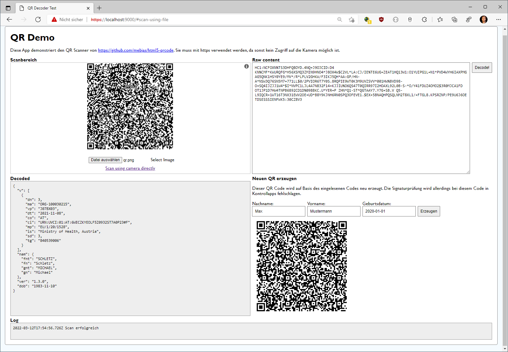

# Ein Node.js Projekt anlegen

Als erstes Projekt in Node.js legen wir eine Applikation an, die COVID QR Codes einlesen und
dekodieren soll.



## Starten des Projektes

Im Ordner [CovidQrDecoder](CovidQrDecoder) befindet sich ein fertig implementiertes Projekt.
Gehe in das Verzeichnis mit der Datei *package.json* und führe die folgenden Befehle aus:

```
npm install
npm run serve
```

Auf *https://localhost:9000* wird nun der Dev Server mit der Applikation gestartet.

Zum Verständnis werden die erforderlichen Schritte um ein Projekt mit Webpack zu erstellen 
in den nachfolgenden Punkten erklärt.

## Anlegen des Projektes

Lege ein Verzeichnis *CovidQrDemo* an. Starte in diesem Verzeichnis mit *npm init* den Assistenten.

```
md CovidQrDemo
cd CovidQrDemo
npm init -y
```

Es entsteht nun eine Datei *package.json*, die die eingegebenen Informationen speichert. Natürlich
kann diese Datei noch nachträglich geändert werden.

## Schritt 1: Anlegen der Ordnerstruktur

Lege nun ein Verzeichnis *public* und ein Verzeichnis *src* an. Erstelle im Verzeichnis *public*
eine Datei *index.html* und befülle sie mit einem HTML 5 Grundgerüst. In VS Code kann dies mit
Rufzeichen (!) einfach erledigt werden.

Die Datei *index.js* im Ordner *src* ist vorerst noch leer. Am Ende muss die Struktur so aussehen:

```
CovidQrDemo
     │   package.json
     │
     ├───public
     │       index.html
     │
     └───src
             index.js
```

## Schritt 2: Konfiguration von Webpack

Node.js baut stark auf den Package Manager *npm* auf. Es können Zusatzpakete geladen werden,
sodass wir nicht alles selbst entwickeln müssen.

### Was ist Webpack?

Durch den Einsatz von Paketen ergeben sich *Abhängigkeiten* (Dependencies). Wenn wir einfach
unsere index.js Datei im Browser einbinden, werden die Funktionen aus den Zusatzpaketen nicht
gefunden. Der Browser kann auch keine Pakete einfach nachinstallieren. Wir brauchen also einen
Mechanismus, der unseren Code samt den verwendeten Code aus den Paketen zusammenbündelt. Diese
Datei nennt man *bundle*. Diese Datei kann dann mit *script src* eingebunden werden.

### Laden des ersten Paketes: base45

Wir möchten COVID QR Codes auswerten. Der Inhalt hat eine spezielle Codierung: base45. Hier werden
binäre Inhalte mit "normalen" Zeichen wie A-Z, 0-9 und einigen Satzzeichen codiert. Geben wir in
Google *npm base45* ein, erhalten wir 2 Suchergebnisse: *base45 - npm* und *base45-web*.

Bevor ein Paket geladen wird, kontrollieren wir auf der npm Seite einige Punkte:

- Wann wurde das Paket zuletzt aktualisiert? Verwende keine Pakete, dessen letztes Update schon
  jahrelang zurück liegt.
- In welcher Version liegt das Paket vor? Verwende keine Pakete, die nur in der Version 0
  vorliegen.
- Klicke auf die Homepage des Projektes. Ist das Paket dort gut beschrieben?
- Und zum Schluss das Wichtigste: Dieser Code soll im Browser ausgeführt werden. Ist das Paket
  auch im Browser lauffähig? Leider gibt es kein einheitliches Kennzeichen. Meist sind
  Pakete für den Browser speziell mit *web* oder *browser* gekennzeichnet.
- Sieh dir auch den Quellcode, vor allem die Datei *package.json* an. Hat das Paket Abhängigkeiten
  zu Paketen, die den oben genannten Kriterien nicht entsprechen?

Es gibt einige Pakete, die sich im Browser nicht ausführen lassen. Node.js ist nur das Buildsystem,
schlussendlich führt der Browser dann das Bundle aus. Greift z. B. ein Paket mit dem *fs* Modul
auf das Dateisystem zu, wird dies nie im Browser funktionieren-

Wir verwenden das Paket [base45-web](https://www.npmjs.com/package/base45-web), da es auch im
Browser ausführbar ist. Ein Paket wird mit dem Befehl

```
npm install (Paketname)
```

im Ordner mit der Datei *package.json* installiert. Standardmäßig wird das Paket als Dependency
in die Datei *package.json* aufgenommen. Zusätzlich wird ein Ordner *node_modules* angelegt, wo
das Paket gespeichert wird.

Am Besten verwende die Konsole in VS Code (STRG + Ö). Mit *npm install base45-web* installieren
wir das Paket.

### Verwenden des Paketes in index.js

Nun verwenden wir das Paket und schreiben eine einfache Decode Funktion. Sie prüft mit einem
regulären Ausdruck, ob nur gültige Base45 Zeichen im String vorkommen.

Der Befehl *import* wirkt wie using in C#. Erst nach dem *import* Befehl kann das Paket unter dem
angegebenen Namen genutzt werden.

```javascript
import base45 from 'base45-web'

function decode(base45String) {
    base45String ??= "";  // Avoid null
    const match = /^([ $%*+\-./:0-9A-Z]+)$/.exec(base45String);
    if (!match) { throw "Invalid base45 string."; }

    return base45.decode(base45String);
}

export {
    decode
}
```

#### import oder require?

Oft findet man Code, der *require* statt *import* verwendet. Das Schlüsselwort *import* ist nur
in Node.js Projekten, die Module verwenden, zulässig. Es ist die bevorzugte Variante, da auch
spezifische Objekte aus dem Modul geladen werden können. Außerhalb von Modulen wird *require()*
verwendet.

> In [CovidQrDecoder](CovidQrDecoder) befindet sich ein lauffähiges Projekt.

### Installation von Webpack

Webpack ist ein sehr mächtiges Paket. Auf [der Projektseite](https://webpack.js.org/guides/getting-started)
siehst du die vielen Konfigurationsmöglichkeiten.

Wir installieren 3 Pakete: *webpack*, *webpack-cli* und das *html-webpack-plugin*. 
Der Parameter *save-dev* gibt an, dass das
Paket nur zur Entwicklung benötigt wird. Es wird in der Datei *package.json* als devDependency
eingetragen.

```
npm install webpack webpack-cli html-webpack-plugin  --save-dev
```

Nach der Installation werden scripts in der Datei *package.json* registriert. Ein Skript kann mit
*npm run Scriptname* aufgerufen werden. Die nachfolgende *package.json* Datei legt 2 Skripts
an:

- **build** startet das CLI (command line tool) webpack und erstellt ein Bundle für den Production Einsatz.
- **serve** startet einen dev Server, um bei der Entwicklung das Projekt sofort im Browser testen
  zu können.

Ergänze nun den *scripts* Eintrag in der Datei *package.json*:

**package.json**

```json
{
  "main": "index.js",
  "scripts": {
    "build": "webpack --config webpack.config.js",
    "serve": "webpack serve --config webpack.config.js --mode=development"
  },
  "dependencies": {
    "base45-web": "^1.0.2"
  },
  "devDependencies": {
    "html-webpack-plugin": "^5.5.0",
    "webpack": "^5.70.0",
    "webpack-cli": "^4.9.2"
  }
}
```

### Konfiguration von Webpack

Im Skript wird auf die Datei *webpack.config.js* verwiesen. Diese muss jetzt im Hauptordner (wo
auch die Datei *package.json* ist) angelegt werden. Webpack hat eine Menge zu erledigen:

- Es muss aus unserem Code ein Bundle erstellen und als Variable bereitstellen. Wir konfigurieren
  den Namen *QrDecoder*. 
- Die Datei *public/index.html* soll gelesen und ein *script* element eingefügt werden, welches das
  Bundle lädt.

**webpack.config.js**

```javascript
const HtmlWebpackPlugin = require('html-webpack-plugin');
const path = require('path');

module.exports = {
  mode: 'production',
  devServer: {
    static: {
      directory: path.join(__dirname, 'public'),
    },
    compress: true,
    port: 9000,
    https: true
  },
  output: {
    filename: '[name].bundle.js',
    libraryTarget: "var",
    library: "QrDecoder",
    clean: true
  },
  plugins: [
    new HtmlWebpackPlugin({
      template: 'public/index.html',
      inject: 'head',
      scriptLoading: 'blocking'
    })],
}
```

### Starten des Servers

Starte mit folgendem Befehl in der Konsole von VS Code den dev-server. Beim ersten Start wird
das Paket *webpack-dev-server* installiert.

```
npm run serve
```

Nun kann der Browser mit der URL *https://localhost:9000/* geöffnet werden. Zertifikatsfehler
müssen ignoriert werden, da das generierte Zertifikat nicht als vertrauenswürdiges Zertifikat
im Betriebssystem installiert wurde.

Es erscheint ein leeres Fenster, da wir noch keine Ausgaben in die Datei *index.htm* geschrieben haben.
Wenn wir uns aber den Quelltext im Browser ansehen, sehen wir einen interessanten Eintrag. Webpack
hat im Header ein *script* Element eingefügt, welches das Bundle lädt.

```html

<!DOCTYPE html>
<html lang="de">
    <head>
        <!-- header elements -->
        <script src="main.bundle.js"></script>
    </head>

    <body>
    </body>
</html>
```

Sehen wir uns die Datei *main.bundle.js* an (klicke in der Quelltext Ansicht auf diese Datei),
erscheint der zusammengebündelten Code. Er bsteht aus unseren Code in der Datei *index.js* sowie
aus dem Code der eingebundenen und verwendeten Pakete.

### Aufrufen unseres Modules

Wir haben in der Datei *index.js* den *export* Befehl verwendet und in der Datei *webpack.config.js*
den library Namen als *QrDecoder* definiert. Daher können wir mit *QrDecoder.decode()* unsere
exportierte Funktion nun in HTML aufrufen:

**index.html**

```html
<!DOCTYPE html>
<html lang="de">

<head>
    <meta charset="UTF-8">
    <meta http-equiv="X-UA-Compatible" content="IE=edge">
    <meta name="viewport" content="width=device-width, initial-scale=1.0">
    <title>QR Checker</title>
</head>

<body>
    <input id="encoded" type="text" value="%69 VD82EI2B.KESTC" />
    <button onclick="decode()">Decode!</button>
    <pre id="decoded"></pre>

    <script>
        function decode() {
            document.getElementById("decoded").innerText = QrDecoder.decode(document.getElementById("encoded").value);
        }
    </script>

</body>
</html>
```

## Der Linter EsLint

Schreiben wir in der Datei *index.js* z. B. den Befehl *return base45.decode(undefinedVariable);*
erscheint kein Fehler. Erst in der Browserkonsole bekommen wir den Hinweis, dass die Variable
*undefinedVariable* nicht definiert wurde. Das ist natürlich sehr unangenehm.

Deswegen gibt es sogenannte *Linter*. Sie analysieren den Code und zeigen mögliche Fehler auf. In
der Konsole von VS Code installieren wir nun das Paket *eslint*. Mit *CTRL+C* beenden wir vorher den
dev-server.

Das Initialisieren der Konfiguration geschieht mit einem Assistenten. Die Antworten sind unten
angeführt:

```
npm install eslint --save-dev
npm init @eslint/config

? How would you like to use ESLint? ... 
  > To check syntax and find problems
? What type of modules does your project use? ... 
  > JavaScript modules (import/export)
? Which framework does your project use? ... 
  > None of these
? Does your project use TypeScript? » No
? Where does your code run? ...  (Press <space> to select, <a> to toggle all, <i> to invert selection)
  √ Browser
? What format do you want your config file to be in? ... 
  > JSON
```

Es wird nun eine Datei *eslintrc.json* erzeugt. Verschiebe diese Datei in den Ordner *src*, da wir
nur Dateien innerhalb dieses Ordners prüfen wollen.

Nun muss in der Datei *index.js* der Befehl *return base45.decode(undefinedVariable);* rot
unterstrichen sein.

## Babel: Neue ECMAScript Features übersetzen

Unser Code wird im Browser ausgeführt. Dadurch haben wir allerdings keinen Einfluss darauf, welche
Features die JavaScript Engine unterstützt. Manche verwenden noch ändere Browser, die neue
Sprachkonstrukte nicht unterstützen.

Auf der [Webseite von Babel](https://babeljs.io/repl) siehst du gleich das Funktionsprinzip.
Links ist ein Ausdruck, der die neuste ECMAScript Syntax verwendet. Rechts wird die übersetzte
ES2015 Version für den Browser angegeben.

Um Babel für unser Projekt nutzen zu können, installieren wir zuerst 3 Pakete:

- **@babel/core** Das Kernbapet von babel
- **@babel/preset-env** Vordefinierte Presets, welche Syntax in welche Version übersetzt werden muss.
- **abel-loader** für webpack, da unser Code vor dem Erstellen des Bundles von Babel verarbeitet
  werden muss.

```
npm install  @babel/core @babel/preset-env babel-loader --save-dev
```

Damit die Verarbeitung von Webpack gestartet wird, fügen wir das Modul zur Datei *webpack.config.js*
als *module* hinzu:

**webpack.config.js**

```javascript
const HtmlWebpackPlugin = require('html-webpack-plugin');
const path = require('path');

module.exports = {
  // ...
  module: {
    rules: [
      {
        test: /\.(js)$/,
        exclude: /node_modules/,
        use: ['babel-loader']
      }   
    ]
  },
 // ...
}
```

Das verwendete Set an Regeln wird in einer eigenen Datei (*babel.config.json*) definiert:

**babel.config.json**

```json
{
    "presets": [
        "@babel/preset-env"
    ]
}
```

Wenn wir nun mit *npm run serve* den Server wieder starten, können wir in der Quelltext
Anzeige den Inhalt von *main.bundle.js* analysieren. 

```javascript
/*!**********************!*\
  !*** ./src/index.js ***!
  \**********************/
"use strict";
eval("__webpack_require__.r(__webpack_exports__);\n/* harmony export */ __webpack_require__.d(__webpack_exports__, {\n/* harmony export */   \"decode\": () => (/* binding */ decode)\n/* harmony export */ });\n/* harmony import */ var base45_web__WEBPACK_IMPORTED_MODULE_0__ = __webpack_require__(/*! base45-web */ \"./node_modules/base45-web/lib/base45-js.js\");\n/* harmony import */ var base45_web__WEBPACK_IMPORTED_MODULE_0___default = /*#__PURE__*/__webpack_require__.n(base45_web__WEBPACK_IMPORTED_MODULE_0__);\n\n\nfunction decode(base45String) {\n  var _base45String;\n\n  (_base45String = base45String) !== null && _base45String !== void 0 ? _base45String : base45String = \"\"; // Avoid null\n\n  var match = /^([ $%*+\\-./:0-9A-Z]+)$/.exec(base45String);\n\n  if (!match) {\n    throw \"Invalid base45 string.\";\n  }\n\n  return base45_web__WEBPACK_IMPORTED_MODULE_0___default().decode(base45String);\n}\n\n\n\n//# sourceURL=webpack://QrDecoder/./src/index.js?");
```

Die Anweisung *base45String ??= "";* wurde durch folgenden Block ersetzt:

```javascript
(_base45String = base45String) !== null && _base45String !== void 0 ? _base45String : base45String = "";
```
