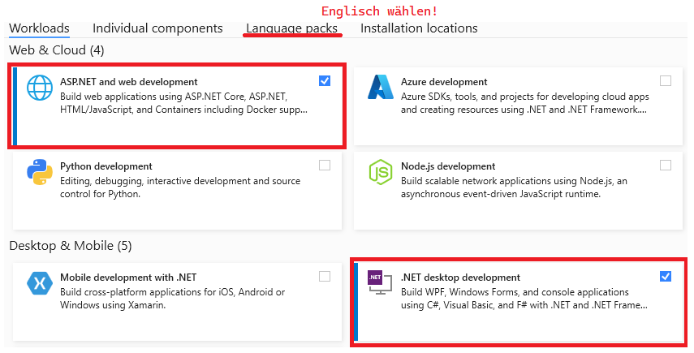
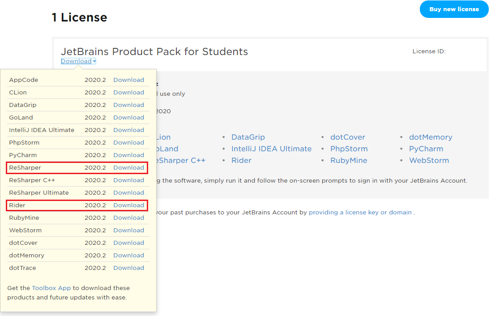

# Installation der benötigten Software

## Node.js

Lade von https://nodejs.org/en/ die LTS Version von Node.js. Beachte bei der Installation folgendes:
- Installiere den Server unter Windows in *C:\\nodejs* und nicht in einem tief verschachtelten Verzeichnis.
- Verwende für die Installation unter macOS die Software Homebrew (https://brew.sh/). Danach kann
  mit *brew install node* im Terminal Node.js installiert werden.

Am Ende der Installation sollte der Befehl *node --version* die aktuelle Version ausgeben:

```
C:\Users\MyUser>node --version
v16.13.1
```

## Visual Studio Code

Zum Entwickeln von JavaScript Code gibt es natürlich viele IDEs und Editoren. Wir werden Visual
Studio Code verwenden. Lade daher von https://code.visualstudio.com/ den Editor für dein
Betriebssystem herunter.

> **Hinweis:** Aktiviere beim Setup die Option
>  *Add "Open with Code" action to Windows Explorer file context menu* und
>  *Add "Open with Code" action to Windows Explorer directory context menu*.
> Da Node.js Projekte nicht als Einzeldatei geöffnet werden können, ist diese Option sehr hilfreich!

Danach installiere über das Extension Menü die folgenden Extensions:
- *Vetur* für die Entwicklung von Vue.js Applikationen.

## Installation von Visual Studio 2022

Für die Backend Entwicklung kommt ASP.NET Core zum Einsatz.
Die verbreitetste IDE zur Entwicklung im .NET Bereich ist Visual Studio. Microsoft stellt unserer
Schule eine Lizenz von Visual Studio Enterprise zur Verfügung.

- Lade die Testversion von Visual Studio **Enterprise** von https://visualstudio.microsoft.com/de/downloads/
  herunter.
- Installiere die nachfolgenden Workloads und achte bei den Sprachpaketen darauf, nur *Englisch* auszuwählen.
- Der Key wird im Unterricht ausgegeben.



### Alternativ: Verwenden von JetBrains Rider

Eine andere weit verbreitete Entwicklungsumgebung - gerade unter macOS - ist Rider von JetBrains.
Wer mit IntelliJ gut arbeiten konnte, kann auch mit der Schullizenz Rider beziehen. Logge dich dafür
auf https://account.jetbrains.com/login ein. Wer noch keinen Zugang hat, kann mit der Schul Mailadresse
eine Lizenz gratis beziehen. Nach dem Login steht Rider als Download zur Verfügung


