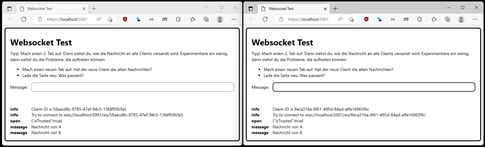

# ASP.NET Core Websocket Demo

## Starten des Servers

Führe im Verzeichnis *WebsocketDemo* den folgenden Befehl aus:

```
dotnet run -c Debug
```

Öffne danach den Browser mit der URL **https://localhost:5001**.


