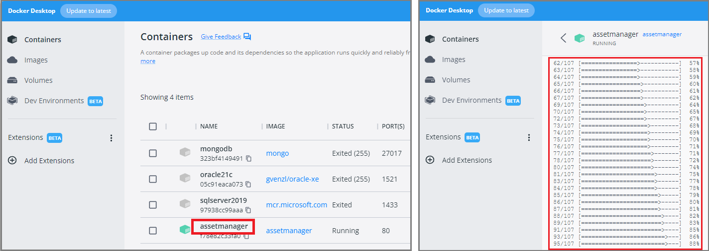

# Erstellen des Devservers

Gehe in der Konsole in das Verzeichnis *apache_devserver* und führe die folgenden Befehle aus
(mit Enter bestätigen). Der Pfad *C:\Temp\assetmanager* ist anzupassen und soll auf das Verzeichnis
auf deinem Rechner zeigen, wo die Applikation ist.

```
docker rm -f assetmanager
docker volume prune -f
docker image prune -f
docker build -t assetmanager . 

docker stop sqlserver2019

docker network rm assetmanagerNetwork
docker network create --subnet=10.0.1.0/24 assetmanagerNetwork
docker network connect --ip 10.0.1.2 assetmanagerNetwork sqlserver2019

docker create -p 80:80  -v C:\Temp\assetmanager:/var/www/html --network=assetmanagerNetwork --ip=10.0.1.3 --name assetmanager assetmanager
```

Die Befehle richten erstmalig das Netzwerk ein. Danach muss in Docker Desktop nur mehr der
Container *sqlserver2019* und der Container *assetmanager* gestartet werden. Wie zu erkennen ist,
ist der SQL Server für Skripts im *assetmanager* Container unter *10.0.1.2* zu erreichen.

> Hinweis: Der Container *assetmanager* erstellt ein leeres Laravel Projekt, wenn der Ordner,
> auf den */var/www/html* zeigt, leer ist. Das dauert einige Zeit, d. h. beim ersten Start reagiert
> der Webserver erst nach ca. 1 Minute. Du kannst die Ausgaben des Containers nachsehen, indem
> du in Docker Desktop auf den Namen des (laufenden) Containers klickst:



Es wird auch ein Testskript für den SQL Server in den *public* Ordner kopiert. Mit
*http://localhost/sql_server_test.php* kannst du es im Browser aufrufen.
